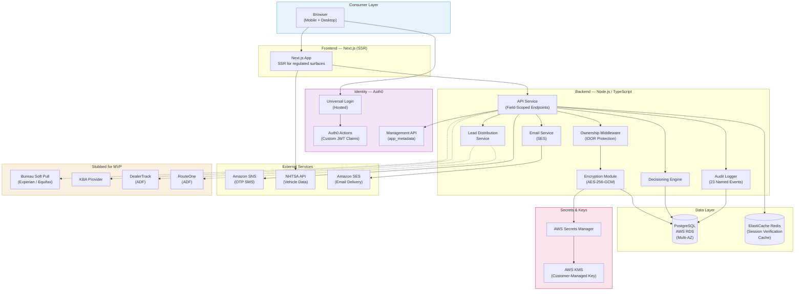
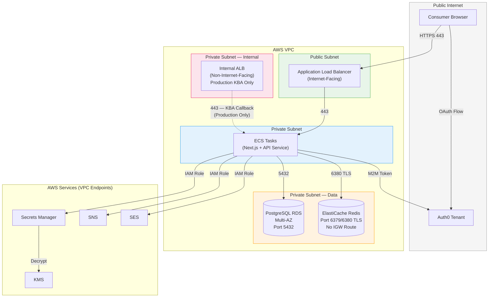
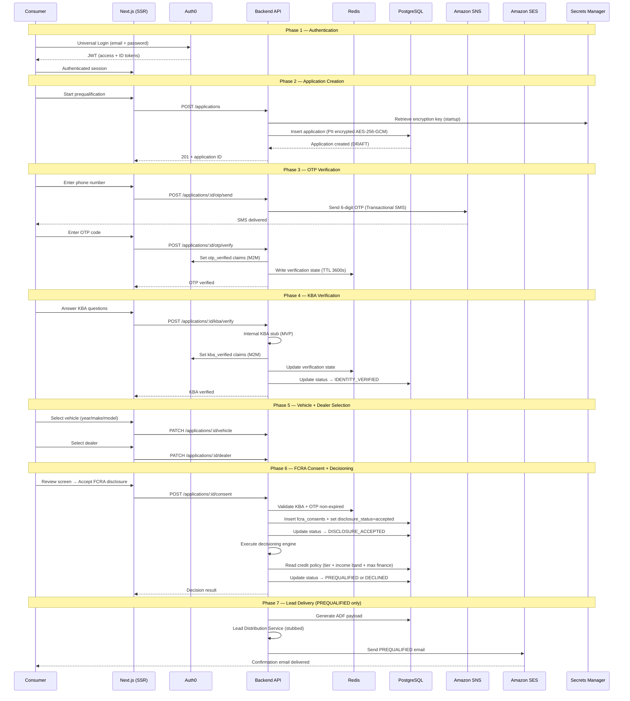
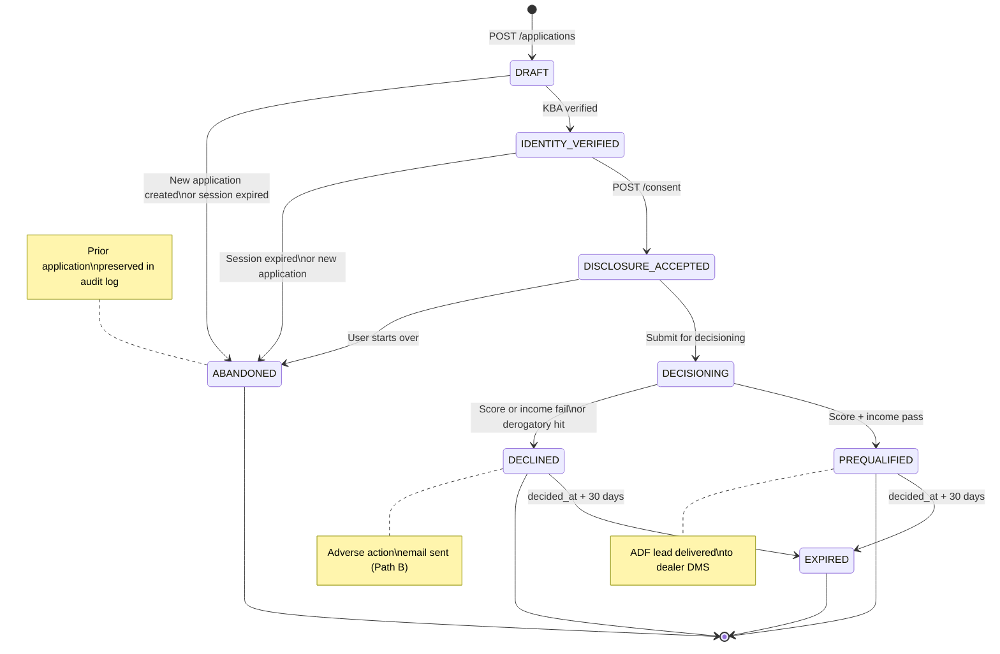
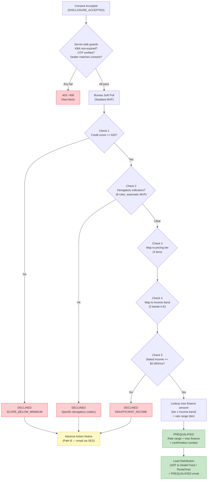
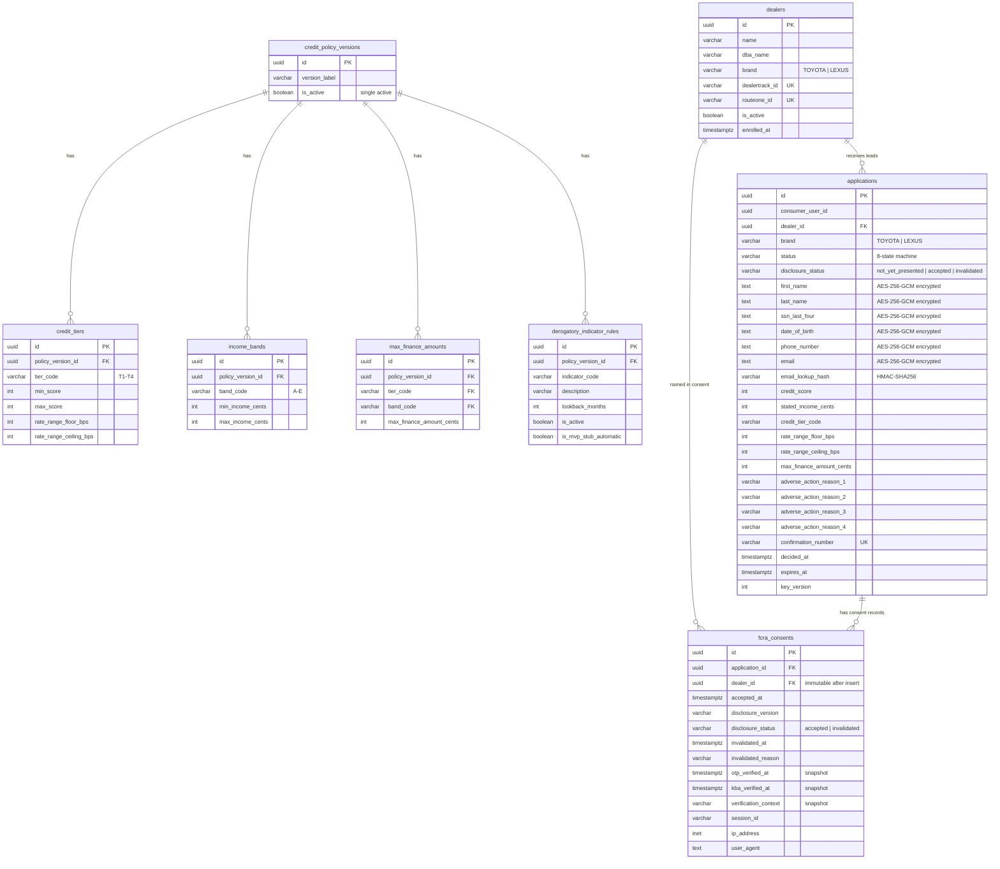
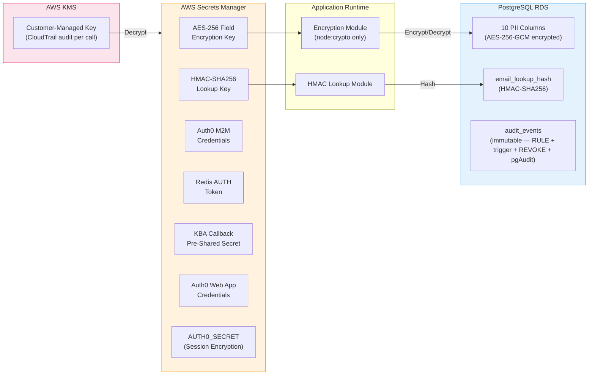

# System Architecture Diagram

> **Project:** Auto Leads Platform
> **Status:** Complete
> **Last updated:** 2026-04-12

---

## 1. High-Level System Overview

The platform's components, external services, and data stores with their primary interaction paths.



---

## 2. VPC Network Topology

Security group boundaries, subnet placement, and network isolation for all infrastructure components.



**Security group rules summary:**

| Source | Target | Port | Purpose |
|--------|--------|------|---------|
| `0.0.0.0/0` | ALB | 443 | Consumer HTTPS |
| ALB SG | ECS SG | 443 | App traffic |
| ECS SG | RDS SG | 5432 | Database |
| ECS SG | Redis SG | 6380 | Session cache (TLS) |
| KBA Provider CIDR | Internal ALB | 443 | KBA callback (prod only) |
| Internal ALB SG | ECS SG | 443 | KBA callback forwarding |

Redis and RDS have **no inbound from `0.0.0.0/0`** on any port. Redis has **no route to IGW**.

---

## 3. Consumer Request Flow

The end-to-end prequalification flow from account creation through lead delivery.



---

## 4. Application State Machine

The 8 application states, 11 transitions, and 4 terminal states.



**State rules:**
- **Terminal states:** PREQUALIFIED, DECLINED, ABANDONED, EXPIRED
- **Single active application:** new DRAFT creation auto-abandons any existing DRAFT or IDENTITY_VERIFIED record for the same `consumer_user_id`
- **IDENTITY_VERIFIED not resumable** after session expiry (60-min KBA claim window elapsed)
- **DRAFT resumable** within a valid session

---

## 5. Decisioning Engine Flow

Credit policy evaluation from FCRA consent through outcome determination.



**Decisioning lookup query (single read):**
```sql
SELECT ct.tier_code, ct.rate_range_floor_bps, ct.rate_range_ceiling_bps,
       mfa.max_finance_amount_cents
FROM credit_tiers ct
JOIN income_bands ib ON ib.policy_version_id = ct.policy_version_id
JOIN max_finance_amounts mfa ON mfa.tier_code = ct.tier_code
                             AND mfa.band_code = ib.band_code
                             AND mfa.policy_version_id = ct.policy_version_id
WHERE ct.policy_version_id = (SELECT id FROM credit_policy_versions WHERE is_active = true)
  AND $credit_score BETWEEN ct.min_score AND ct.max_score
  AND $stated_income_cents BETWEEN ib.min_income_cents AND ib.max_income_cents;
```

---

## 6. Data Model — Entity Relationship



---

## 7. Encryption & Secrets Architecture

How encryption keys, secrets, and PII protection are layered across the system.



**Ciphertext blob format:** `[4-byte key_version][12-byte IV][16-byte auth tag][ciphertext]` as base64url

**Key rules:**
- AES-256-GCM (not CBC) — authenticated encryption; tampered ciphertext fails explicitly
- Hard fail on startup if encryption key unavailable (5 retries then `process.exit(1)`)
- 503 with `Retry-After: 30` on in-request outage; 10-min stale-key grace window
- HMAC rotation requires re-hash sweep (one-way function; no dual-key window)
- No third-party crypto libraries — `node:crypto` only

---

## 8. Audit Log Architecture

23 named events across 3 retention categories with layered immutability enforcement.

| Category | Retention | Write Mode | Events |
|----------|-----------|------------|--------|
| **FCRA_7YR** | 7 years | Synchronous (in parent transaction) | consent_accepted, consent_invalidated, bureau_pull_executed, adverse_action_sent, lead_delivered |
| **SECURITY** | 1 year | Separate transaction | otp_sent, otp_verified, otp_failed, kba_verified, kba_failed, login_success, login_failed, ownership_mismatch |
| **OPERATIONAL** | 90 days | Separate transaction | application_created, application_submitted, application_decided, dealer_changed, vehicle_changed, email_sent, status_transition, policy_version_activated, encryption_key_rotated, application_abandoned |

**Immutability enforcement (4 layers):**
1. PostgreSQL RULE — silently suppresses UPDATE/DELETE (defense in depth)
2. PostgreSQL trigger — raises exception on UPDATE/DELETE (visible error in pgAudit)
3. Application role REVOKE — no UPDATE/DELETE privilege granted
4. pgAudit — logs any attempted modification

**PII exclusion:** `sanitizeEventData()` throws on known PII keys (does not silently strip). Event data contains only IDs, status codes, reason codes, and counts.

---

*← [Auto Leads Platform — Progress](../progress.md)*
