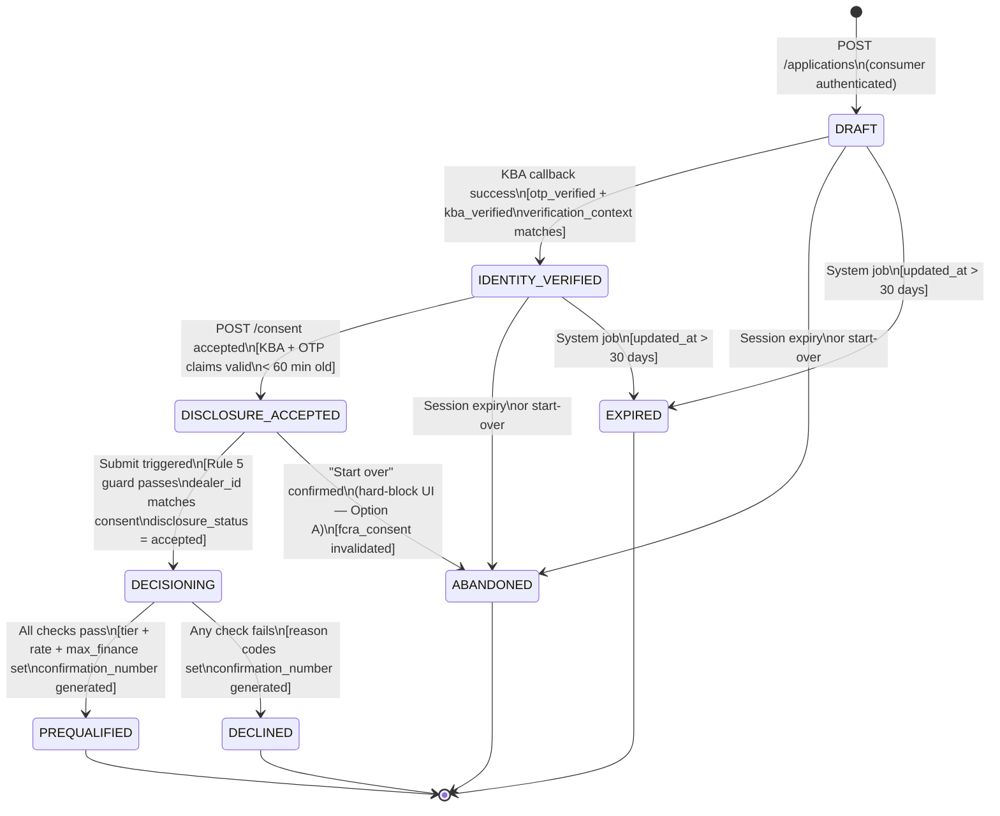

do i need # Data Dictionary & Schema — Auto Leads Platform

> **Agent:** Architect
> **Project:** auto-leads-platform
> **Status:** Active — applications table, vehicle storage decision, application state machine, credit policy config tables, expires_at, and key_version defined
> **Last updated:** 2026-04-11
> **Depends on:** dealers table (architecture.md §Item 4), fcra_consents table (architecture.md §Item 4)

---

## Previously Defined Tables (canonical definitions in architecture.md §Item 4)

- `dealers` — UUID PK, name, dba_name, brand CHECK (TOYOTA/LEXUS), address fields, dealertrack_id, routeone_id, is_active soft-delete, enrolled_at, deactivated_at, created_at, updated_at
- `fcra_consents` — id, application_id FK, dealer_id FK, accepted_at, disclosure_version, disclosure_status, otp_verified_at, kba_verified_at, verification_context, session_id, invalidated_at, invalidated_reason, ip_address, user_agent, created_at

This document defines the `applications` table, the vehicle storage approach, and the application state machine.

---

## 1. Vehicle Storage Decision — Inline Fields vs. Lookup Table

**Decision: Inline vehicle fields on the `applications` record. No separate `vehicles` lookup table.**

**Rationale:**

The platform uses the NHTSA API for year/make/model/trim selection at form time. NHTSA data is reference data maintained externally; there is no operational reason for the platform to maintain a parallel `vehicles` table that replicates it. Vehicle selection is a consumer-stated preference captured at application time, not a persistent entity the platform manages.

A `vehicles` lookup table would be appropriate if:
- The platform needed to restrict vehicle eligibility to a specific inventory (dealer lot management) — not in scope for MVP
- Multiple applications frequently reference the same vehicle, creating a de-duplication benefit — not the case here; each application captures the consumer's stated vehicle preference independently
- Vehicle records required independent audit or update lifecycle — they do not

Inline fields on `applications` are the correct approach because:
1. Vehicle data is immutable after submission (no vehicle PATCH after `disclosure_status = accepted`)
2. The NHTSA API is the authoritative source; capturing a snapshot at application time is the correct data model
3. The `PATCH /applications/:id/vehicle` endpoint writes directly to the `applications` row — no join required
4. ADF lead delivery reads vehicle fields directly from the application record

**Vehicle fields on `applications`:** `vehicle_year`, `vehicle_make`, `vehicle_make_code`, `vehicle_model`, `vehicle_model_code`, `vehicle_trim`, `vehicle_trim_code`. Make/model/trim codes are the NHTSA API identifiers stored alongside display names to avoid re-lookup at delivery time.

**New Toyota/Lexus only:** `vehicle_condition` field is not required for MVP. Platform scope is new vehicles only (decisions log: "Prequal scope: new vehicles only for Toyota and Lexus"). Add `vehicle_condition` if used or certified pre-owned is added post-MVP.

---

## 2. `applications` Table Schema

```sql
-- =============================================================================
-- TABLE: applications
-- Retention: 7 years from created_at (FCRA + ECOA compliance record)
-- PII fields: AES-256 column-level encryption via pgcrypto
--             Encrypted fields marked [PII-ENCRYPTED] in comments
-- Monetary values: stored as integers (cents) — no floats
-- =============================================================================

CREATE TABLE applications (
  -- ---------------------------------------------------------------------------
  -- Primary identifiers
  -- ---------------------------------------------------------------------------
  id                          UUID          PRIMARY KEY DEFAULT gen_random_uuid(),

  -- Consumer-facing reference number; format: PQ-YYYYMMDD-[8 Crockford Base32]
  -- Generated server-side via CSPRNG; unique; never sequential or guessable
  confirmation_number         VARCHAR(20)   UNIQUE,           -- NULL until PREQUALIFIED or DECLINED; set at decisioning
                                                              -- Indexed below for support/dealer lookup

  -- ---------------------------------------------------------------------------
  -- Brand
  -- ---------------------------------------------------------------------------
  -- The brand skin active when the consumer submitted the application.
  -- Set at application creation; immutable thereafter.
  -- Determines: NHTSA vehicle make filter, visual skin, and ADF lead context.
  -- Credit policy is identical for both brands.
  brand                       VARCHAR(10)   NOT NULL
                              CHECK (brand IN ('TOYOTA', 'LEXUS')),

  -- ---------------------------------------------------------------------------
  -- Consumer identity
  -- ---------------------------------------------------------------------------
  -- Auth0 sub claim; links application to the authenticated consumer account.
  -- Not a FK to a local users table — Auth0 is the authoritative identity store.
  consumer_user_id            VARCHAR(255)  NOT NULL,         -- Auth0 sub claim

  -- PII fields: AES-256 column-level encryption (pgcrypto)
  -- Storage type TEXT to accommodate ciphertext; application layer handles
  -- encrypt/decrypt via shared key stored in AWS Secrets Manager.
  first_name                  TEXT          NOT NULL,         -- [PII-ENCRYPTED]
  last_name                   TEXT          NOT NULL,         -- [PII-ENCRYPTED]
  date_of_birth               TEXT          NOT NULL,         -- [PII-ENCRYPTED] stored as ISO-8601 date string pre-encryption
  ssn_last_four               TEXT          NOT NULL,         -- [PII-ENCRYPTED] 4-digit string; leading zero preserved
  phone_number                TEXT          NOT NULL,         -- [PII-ENCRYPTED] E.164 format pre-encryption

  -- Email address: used for adverse action notice delivery and account correlation.
  -- AES-256 encrypted per PII standard; application maintains a deterministic
  -- hash (HMAC-SHA256) for lookup without requiring decryption.
  email                       TEXT          NOT NULL,         -- [PII-ENCRYPTED]
  email_lookup_hash           VARCHAR(64)   NOT NULL,         -- HMAC-SHA256 of normalized email; for lookup only; not reversible

  -- Address fields: AES-256 encrypted
  address_line_1              TEXT          NOT NULL,         -- [PII-ENCRYPTED]
  address_line_2              TEXT,                           -- [PII-ENCRYPTED] nullable
  city                        TEXT          NOT NULL,         -- [PII-ENCRYPTED]
  state_code                  CHAR(2)       NOT NULL,         -- [PII-ENCRYPTED] ISO 3166-2 US state code
  zip_code                    TEXT          NOT NULL,         -- [PII-ENCRYPTED]

  -- ---------------------------------------------------------------------------
  -- Encryption metadata
  -- ---------------------------------------------------------------------------
  -- Version of the AES-256 field encryption key (FEK) used to encrypt all
  -- [PII-ENCRYPTED] columns in this row. Incremented when key rotation is
  -- performed. Used by the re-encryption batch job to identify rows encrypted
  -- under a prior key version. See ADR-006 for rotation protocol.
  key_version                 INTEGER       NOT NULL DEFAULT 1,

  -- ---------------------------------------------------------------------------
  -- Vehicle fields (inline snapshot from NHTSA API at selection time)
  -- ---------------------------------------------------------------------------
  -- Vehicle fields are consumer-stated preferences, not managed inventory.
  -- Immutable after disclosure_status = 'accepted'.
  -- NHTSA codes stored alongside display names to avoid re-lookup at ADF delivery.
  vehicle_year                SMALLINT,                       -- e.g. 2025; SMALLINT sufficient for model year
  vehicle_make                VARCHAR(50),                    -- e.g. 'Toyota'
  vehicle_make_code           VARCHAR(20),                    -- NHTSA make ID
  vehicle_model               VARCHAR(100),                   -- e.g. 'Camry'
  vehicle_model_code          VARCHAR(20),                    -- NHTSA model ID
  vehicle_trim                VARCHAR(100),                   -- e.g. 'XSE V6'
  vehicle_trim_code           VARCHAR(20),                    -- NHTSA trim ID; nullable (not all selections have trim)

  -- ---------------------------------------------------------------------------
  -- Dealer assignment
  -- ---------------------------------------------------------------------------
  -- FK to dealers table. Consumer selects dealer; persisted server-side on
  -- confirmation of selection (not held in client state until submission).
  -- Nullable until dealer selection step is completed.
  dealer_id                   UUID          REFERENCES dealers(id) ON DELETE RESTRICT,

  -- ---------------------------------------------------------------------------
  -- Financial inputs
  -- ---------------------------------------------------------------------------
  -- Consumer-stated monthly gross income in cents (integer; no floats).
  -- Used for credit policy check 5 (income threshold) and max finance
  -- amount lookup (income band classification).
  -- NOT included in ADF payload (exceeds consent scope — decisions log 2026-04-11).
  stated_monthly_income_cents INTEGER,                        -- stored in cents; e.g. 500000 = $5,000/month

  -- ---------------------------------------------------------------------------
  -- Decisioning inputs (bureau stub reference)
  -- ---------------------------------------------------------------------------
  -- MVP: random selection from ~50 pre-generated bureau stub files.
  -- Post-MVP: Experian/Equifax soft pull reference.
  -- Stored to support: audit trail, re-run debugging, stub file replay.
  bureau_stub_file_id         VARCHAR(100),                   -- stub file identifier; NULL until decisioning runs
  bureau_pull_executed_at     TIMESTAMPTZ,                    -- timestamp when bureau pull (or stub pull) executed

  -- ---------------------------------------------------------------------------
  -- Decisioning outputs
  -- ---------------------------------------------------------------------------
  -- Credit score from bureau pull (stub or live). Used for tier assignment.
  credit_score                SMALLINT,                       -- e.g. 720; NULL until decisioning

  -- Assigned credit tier: T1, T2, T3, T4. NULL until decisioning.
  -- Derived from credit score using pricing tier table (credit-policy-spec.md §3).
  credit_tier                 VARCHAR(5)
                              CHECK (credit_tier IN ('T1', 'T2', 'T3', 'T4') OR credit_tier IS NULL),

  -- Rate range: stored as integers in basis points (1 bp = 0.01% APR).
  -- e.g. 5.9% APR = 590 bp; 8.9% APR = 890 bp.
  -- Both NULL until decisioning. Both NULL if outcome is not PREQUALIFIED.
  rate_range_floor_bps        INTEGER,                        -- rate range floor in basis points
  rate_range_ceiling_bps      INTEGER,                        -- rate range ceiling in basis points

  -- Max finance amount in cents. NULL until decisioning.
  -- Derived from tier × income band lookup table (credit-policy-spec.md §4).
  max_finance_amount_cents    INTEGER,                        -- e.g. 3500000 = $35,000

  -- Income band assignment: used to resolve max finance lookup.
  -- Stored for audit trail — allows re-verification of lookup table output.
  income_band                 CHAR(1)
                              CHECK (income_band IN ('A', 'B', 'C', 'D', 'E') OR income_band IS NULL),

  -- ---------------------------------------------------------------------------
  -- Adverse action reason codes (up to 4, in priority order)
  -- ---------------------------------------------------------------------------
  -- Populated when outcome is DECLINED. NULL for PREQUALIFIED and in-progress.
  -- Priority order follows: credit-policy-spec.md §5 multi-reason precedence.
  -- Stored as individual columns (not array) for queryability and index support.
  -- Reason code 1 = highest priority / primary reason presented in notice.
  adverse_action_reason_1     VARCHAR(50)
                              CHECK (adverse_action_reason_1 IN (
                                'CREDIT_SCORE_BELOW_MINIMUM',
                                'DEROGATORY_OPEN_BANKRUPTCY',
                                'DEROGATORY_DISCHARGED_BANKRUPTCY',
                                'DEROGATORY_REPOSSESSION',
                                'DEROGATORY_CHARGE_OFF',
                                'DEROGATORY_FORECLOSURE',
                                'DEROGATORY_TAX_LIEN',
                                'DEROGATORY_AUTO_COLLECTION',
                                'DEROGATORY_MULTIPLE_LATES',
                                'DEROGATORY_COMBINED',
                                'INCOME_BELOW_MINIMUM'
                              ) OR adverse_action_reason_1 IS NULL),

  adverse_action_reason_2     VARCHAR(50)
                              CHECK (adverse_action_reason_2 IN (
                                'CREDIT_SCORE_BELOW_MINIMUM',
                                'DEROGATORY_OPEN_BANKRUPTCY',
                                'DEROGATORY_DISCHARGED_BANKRUPTCY',
                                'DEROGATORY_REPOSSESSION',
                                'DEROGATORY_CHARGE_OFF',
                                'DEROGATORY_FORECLOSURE',
                                'DEROGATORY_TAX_LIEN',
                                'DEROGATORY_AUTO_COLLECTION',
                                'DEROGATORY_MULTIPLE_LATES',
                                'DEROGATORY_COMBINED',
                                'INCOME_BELOW_MINIMUM'
                              ) OR adverse_action_reason_2 IS NULL),

  adverse_action_reason_3     VARCHAR(50)
                              CHECK (adverse_action_reason_3 IN (
                                'CREDIT_SCORE_BELOW_MINIMUM',
                                'DEROGATORY_OPEN_BANKRUPTCY',
                                'DEROGATORY_DISCHARGED_BANKRUPTCY',
                                'DEROGATORY_REPOSSESSION',
                                'DEROGATORY_CHARGE_OFF',
                                'DEROGATORY_FORECLOSURE',
                                'DEROGATORY_TAX_LIEN',
                                'DEROGATORY_AUTO_COLLECTION',
                                'DEROGATORY_MULTIPLE_LATES',
                                'DEROGATORY_COMBINED',
                                'INCOME_BELOW_MINIMUM'
                              ) OR adverse_action_reason_3 IS NULL),

  adverse_action_reason_4     VARCHAR(50)
                              CHECK (adverse_action_reason_4 IN (
                                'CREDIT_SCORE_BELOW_MINIMUM',
                                'DEROGATORY_OPEN_BANKRUPTCY',
                                'DEROGATORY_DISCHARGED_BANKRUPTCY',
                                'DEROGATORY_REPOSSESSION',
                                'DEROGATORY_CHARGE_OFF',
                                'DEROGATORY_FORECLOSURE',
                                'DEROGATORY_TAX_LIEN',
                                'DEROGATORY_AUTO_COLLECTION',
                                'DEROGATORY_MULTIPLE_LATES',
                                'DEROGATORY_COMBINED',
                                'INCOME_BELOW_MINIMUM'
                              ) OR adverse_action_reason_4 IS NULL),

  -- ---------------------------------------------------------------------------
  -- Consent / disclosure state (denormalized from fcra_consents for submission guard)
  -- ---------------------------------------------------------------------------
  -- Denormalized status flag used by the PATCH /applications/:id/dealer endpoint
  -- guard and the bureau pull submission guard (Rule 5, fcra-consent-routing-spec.md).
  -- Authoritative record is fcra_consents table.
  -- Must be updated atomically with fcra_consents writes (same DB transaction).
  disclosure_status           VARCHAR(25)   NOT NULL DEFAULT 'not_yet_presented'
                              CHECK (disclosure_status IN (
                                'not_yet_presented',  -- consumer has not yet reached step 7
                                'accepted',           -- consumer accepted FCRA disclosure at step 7
                                'invalidated'         -- dealer changed post-acceptance; re-acceptance required
                              )),

  -- ---------------------------------------------------------------------------
  -- Application status (state machine — see §3 below)
  -- ---------------------------------------------------------------------------
  status                      VARCHAR(30)   NOT NULL DEFAULT 'DRAFT'
                              CHECK (status IN (
                                'DRAFT',
                                'IDENTITY_VERIFIED',
                                'DISCLOSURE_ACCEPTED',
                                'DECISIONING',
                                'PREQUALIFIED',
                                'DECLINED',
                                'ABANDONED',
                                'EXPIRED'
                              )),

  -- ---------------------------------------------------------------------------
  -- Lead delivery tracking
  -- ---------------------------------------------------------------------------
  -- Populated after ADF payload is generated and delivery is attempted.
  -- MVP: stubbed — payload generated and logged; live endpoints not called.
  lead_delivered_at           TIMESTAMPTZ,                    -- NULL until delivery attempted
  lead_delivery_target        VARCHAR(20)
                              CHECK (lead_delivery_target IN ('DEALERTRACK', 'ROUTEONE') OR lead_delivery_target IS NULL),
  lead_delivery_status        VARCHAR(20)
                              CHECK (lead_delivery_status IN ('PENDING', 'DELIVERED', 'FAILED') OR lead_delivery_status IS NULL),
  lead_delivery_reference     VARCHAR(100),                   -- external delivery reference from DealerTrack/RouteOne; NULL until delivered

  -- ---------------------------------------------------------------------------
  -- Adverse action notice delivery tracking
  -- ---------------------------------------------------------------------------
  adverse_action_notice_sent_at   TIMESTAMPTZ,                -- NULL until notice sent; Path A or Path B
  adverse_action_notice_path      VARCHAR(10)
                                  CHECK (adverse_action_notice_path IN ('PATH_A', 'PATH_B') OR adverse_action_notice_path IS NULL),

  -- ---------------------------------------------------------------------------
  -- Retention and audit
  -- ---------------------------------------------------------------------------
  -- 7-year retention from created_at required by FCRA + ECOA.
  -- Do not delete rows from this table. Archive to cold storage after 7 years.
  -- created_at is the retention start date.
  created_at                  TIMESTAMPTZ   NOT NULL DEFAULT now(),
  updated_at                  TIMESTAMPTZ   NOT NULL DEFAULT now(),

  -- Captures the IP address of the consumer at the time of application creation.
  -- Not PII-encrypted (same rationale as fcra_consents.ip_address — RDS at-rest encryption applies).
  created_from_ip             INET,
  created_from_user_agent     TEXT,

  -- Decisioning completed timestamp. NULL until PREQUALIFIED or DECLINED.
  decisioned_at               TIMESTAMPTZ,

  -- Application abandoned or expired at this timestamp.
  -- Populated when status transitions to ABANDONED or EXPIRED.
  closed_at                   TIMESTAMPTZ,

  -- Free-text field for internal audit notes (operator/system use; not consumer-facing).
  -- e.g. "Stub file: bureau-stub-042.json"; "KBA lockout triggered at 14:23 UTC"
  audit_notes                 TEXT
);

-- =============================================================================
-- INDEXES
-- =============================================================================

-- Primary lookup by consumer (Auth0 sub) — application history, resume flow
CREATE INDEX idx_applications_consumer_user_id
  ON applications(consumer_user_id);

-- Lookup by confirmation number — support queries, dealer portal, audit
CREATE UNIQUE INDEX idx_applications_confirmation_number
  ON applications(confirmation_number)
  WHERE confirmation_number IS NOT NULL;

-- Lookup by dealer — dealer portal, lead delivery queries
CREATE INDEX idx_applications_dealer_id
  ON applications(dealer_id)
  WHERE dealer_id IS NOT NULL;

-- Status queries — operational dashboards, decisioning queue, retry jobs
CREATE INDEX idx_applications_status
  ON applications(status);

-- Consumer + status composite — "find active application for this consumer"
-- Used by resume-flow logic to detect in-progress applications
CREATE INDEX idx_applications_consumer_status
  ON applications(consumer_user_id, status);

-- Email hash lookup — adverse action notice delivery, re-application detection
CREATE INDEX idx_applications_email_lookup_hash
  ON applications(email_lookup_hash);

-- Retention sweep — identify records approaching 7-year window for archival
CREATE INDEX idx_applications_created_at
  ON applications(created_at);

-- Decisioning result queries — adverse action notice job, analytics
CREATE INDEX idx_applications_decisioned_at
  ON applications(decisioned_at)
  WHERE decisioned_at IS NOT NULL;

-- =============================================================================
-- TABLE COMMENT (retention classification)
-- =============================================================================
COMMENT ON TABLE applications IS
  '7-year FCRA + ECOA retention required from created_at. Do not delete rows. '
  'Archive to cold storage after 7 years. PII fields are AES-256 column-level '
  'encrypted; see application encryption key config in AWS Secrets Manager.';

COMMENT ON COLUMN applications.ssn_last_four IS
  '[PII-ENCRYPTED] AES-256. 4-digit string. Not included in ADF payload per GLBA decision 2026-04-11.';
COMMENT ON COLUMN applications.stated_monthly_income_cents IS
  'Consumer-stated; not verified at prequal. Not included in ADF payload per GLBA decision 2026-04-11.';
COMMENT ON COLUMN applications.disclosure_status IS
  'Denormalized from fcra_consents for submission guard. Must be updated atomically '
  'with fcra_consents writes. Authoritative record is fcra_consents table.';
COMMENT ON COLUMN applications.adverse_action_reason_1 IS
  'Highest-priority reason code. DEROGATORY_COMBINED must not appear as reason_1 alone — '
  'requires at least one specific reason code per Reg B §1002.9(b)(2).';
COMMENT ON COLUMN applications.rate_range_floor_bps IS
  'Rate range floor in basis points. 1 bp = 0.01% APR. e.g. 590 = 5.90% APR.';
COMMENT ON COLUMN applications.rate_range_ceiling_bps IS
  'Rate range ceiling in basis points. 1 bp = 0.01% APR. e.g. 890 = 8.90% APR.';
COMMENT ON COLUMN applications.max_finance_amount_cents IS
  'Integer cents. e.g. 3500000 = $35,000. Derived from credit tier × income band lookup.';
```

---

## 3. Adverse Action Reason Code Constraint Note

`DEROGATORY_COMBINED` is included in the reason code CHECK constraints for `adverse_action_reason_2` through `adverse_action_reason_4` only. It is also included on `adverse_action_reason_1` in the DDL above for schema completeness, but the application layer must enforce the Legal SME rule: `DEROGATORY_COMBINED` must not appear as the sole reason (i.e., if `adverse_action_reason_1 = 'DEROGATORY_COMBINED'` and `adverse_action_reason_2` through `adverse_action_reason_4` are all NULL, the decisioning engine must reject the write). This constraint is enforced at the application layer in the decisioning service, not as a DB CHECK constraint, because the CHECK would require a cross-column expression. A trigger or application-layer guard is the implementation mechanism.

**Implementation instruction for Lead Developer:** The decisioning service must validate before writing adverse action reason codes that `DEROGATORY_COMBINED` is never the only populated reason field. If `DEROGATORY_COMBINED` is the only code the decisioning chain produces, the engine must escalate to a specific reason code instead. This is a business rule constraint, not a schema constraint.

---

## 4. ADF Payload Field Exclusions (Schema-Level Enforcement)

Per the decisions log (2026-04-11), these fields are excluded from ADF lead delivery payloads and must never appear in the Lead Distribution Service serialization:

| Field | Exclusion basis |
|-------|-----------------|
| `ssn_last_four` | No dealer business need; GLBA scope-of-consent |
| `stated_monthly_income_cents` | Exceeds consent scope; fair lending risk |
| `adverse_action_reason_1–4` | DECLINED applications never receive lead delivery |

The Lead Distribution Service must construct the ADF payload from an explicit allowlist of fields, not by serializing the full `applications` record. Fields not on the allowlist are excluded structurally, not by conditional logic.

`max_finance_amount_cents` and `rate_range_floor/ceiling_bps` are conditionally included in the ADF payload only with explicit field-specific documented consumer consent at step 7 (decisions log 2026-04-11). The `disclosure_status` flag alone is not sufficient — the step 7 disclosure template must include the specific consent language for these fields, and the `disclosure_version` in `fcra_consents` must resolve to a version that includes that language before including them.

---

## 5. Application State Machine

### 5.1 State Definitions

| State | Description | Terminal? |
|-------|-------------|-----------|
| `DRAFT` | Application record created after consumer authentication and form entry begins. Consumer is entering data (steps 1–5: personal info, vehicle, dealer, income). No identity verification completed. | No |
| `IDENTITY_VERIFIED` | Consumer has completed OTP phone verification and KBA identity challenge. Both `otp_verified` and `kba_verified` claims are active in the session. FCRA disclosure has not yet been presented or accepted. | No |
| `DISCLOSURE_ACCEPTED` | Consumer has accepted the FCRA disclosure at step 7. A corresponding `fcra_consents` row with `disclosure_status = 'accepted'` exists. `applications.disclosure_status = 'accepted'`. Bureau pull authorized. | No |
| `DECISIONING` | Bureau pull (stub or live) has been initiated. Decisioning chain is executing (checks 1–6). The application is locked — no consumer edits permitted during this window. | No |
| `PREQUALIFIED` | All 6 decisioning checks passed. `credit_tier`, `rate_range_floor_bps`, `rate_range_ceiling_bps`, and `max_finance_amount_cents` are populated. `confirmation_number` is set. ADF lead delivery is triggered. | Yes |
| `DECLINED` | One or more decisioning checks failed. `adverse_action_reason_1` (and up to 3 additional codes) are populated. `confirmation_number` is set. Adverse action notice email is triggered. No ADF delivery. | Yes |
| `ABANDONED` | Consumer dropped off or explicitly started over at any non-terminal state. Includes: session expiry during flow, consumer initiating a new application after reaching `DISCLOSURE_ACCEPTED` (C6 — "start over" path). Application record is preserved for audit. Consumer may start a new application. | Yes |
| `EXPIRED` | Application record in a non-terminal state that has not had activity within the expiry window (e.g., DRAFT older than 30 days with no update). System-driven transition for cleanup. | Yes |

**On terminal states:** `PREQUALIFIED`, `DECLINED`, `ABANDONED`, and `EXPIRED` are terminal. No further state transitions are permitted except by an explicitly defined system process (e.g., archival). The application record must not be modified after reaching a terminal state except for `lead_delivery_status` updates on `PREQUALIFIED` records (delivery retry tracking) and `adverse_action_notice_sent_at` on `DECLINED` records.

---

### 5.2 State Transitions

| # | From | To | Trigger event | Guard conditions | Driver |
|---|------|-----|--------------|-----------------|--------|
| T1 | — | `DRAFT` | `POST /applications` — application record created | Consumer authenticated (Auth0 JWT valid) | Consumer |
| T2 | `DRAFT` | `IDENTITY_VERIFIED` | KBA completion confirmed by backend (stub: internal; production: KBA callback) | `otp_verified = true` AND `kba_verified = true` in session; `verification_context` matches this application ID; both timestamps within 60-min window | System (KBA callback triggers status write) |
| T3 | `IDENTITY_VERIFIED` | `DISCLOSURE_ACCEPTED` | `POST /applications/:id/consent` accepted | `disclosure_status != 'accepted'` on existing consent record (no double-accept); `kba_verified = true` AND `otp_verified = true` claims valid and non-expired; `verification_context` matches application ID; KBA claim age < 60 min; application status = `IDENTITY_VERIFIED` | Consumer (via consent endpoint) |
| T4 | `DISCLOSURE_ACCEPTED` | `DECISIONING` | Consumer submits form (triggers bureau pull initiation) | Rule 5 submission guard passes: `disclosure_status = 'accepted'` AND `fcra_consents.dealer_id = applications.dealer_id` AND KBA claim non-expired; application status = `DISCLOSURE_ACCEPTED` | Consumer (submit action) / System (initiates decisioning) |
| T5 | `DECISIONING` | `PREQUALIFIED` | Decisioning chain completes — all 6 checks pass | All checks 1–6 pass; `credit_tier` assigned; `rate_range` populated; `max_finance_amount_cents` populated; `confirmation_number` generated | System (decisioning engine) |
| T6 | `DECISIONING` | `DECLINED` | Decisioning chain completes — one or more checks fail | At least one of checks 1–5 failed; at least one adverse action reason code populated; `confirmation_number` generated; `DEROGATORY_COMBINED` not sole reason code | System (decisioning engine) |
| T7 | `DRAFT` | `ABANDONED` | Session expiry (60-min idle or 4-hour absolute) OR consumer explicitly starts new application | Application status = `DRAFT`; consumer's session has expired or consumer initiated `POST /applications` for a new application while this one is in `DRAFT` | System (session expiry job) / Consumer (start-over action) |
| T8 | `IDENTITY_VERIFIED` | `ABANDONED` | Session expiry OR consumer explicitly starts new application | Application status = `IDENTITY_VERIFIED`; same triggers as T7 | System / Consumer |
| T9 | `DISCLOSURE_ACCEPTED` | `ABANDONED` | Consumer selects "Start over" on confirmation-blocked UI (C6 — Option A hard-block post-acceptance) | Application status = `DISCLOSURE_ACCEPTED`; consumer has been shown the hard-block UI and confirmed "Start over"; prior `fcra_consents` row `disclosure_status` set to `invalidated` with `invalidated_reason = 'user_initiated'` in same transaction | Consumer (explicit start-over) |
| T10 | `DRAFT` | `EXPIRED` | System expiry job identifies stale DRAFT records | Application status = `DRAFT`; `updated_at` older than 30 days (configurable); no active session for this consumer on this application | System (scheduled job) |
| T11 | `IDENTITY_VERIFIED` | `EXPIRED` | System expiry job | Application status = `IDENTITY_VERIFIED`; `updated_at` older than 30 days | System (scheduled job) |

---

### 5.3 Invalid Transitions (Explicitly Prohibited)

| Attempted transition | Why prohibited | Enforcement |
|---------------------|----------------|-------------|
| Any state → `DRAFT` | Once an application has progressed past DRAFT, it cannot regress. A new application creates a new record. | Status CHECK constraint + application layer guard |
| `PREQUALIFIED` → any state | Terminal. | Status CHECK constraint; no write endpoints accept PREQUALIFIED applications as target |
| `DECLINED` → any state | Terminal. | Same as PREQUALIFIED |
| `ABANDONED` → any state | Terminal. Application record is preserved; consumer starts a new application. | Same as above |
| `EXPIRED` → any state | Terminal. | Same as above |
| `DECISIONING` → any consumer-modifiable state | Application is locked during decisioning. No PATCH endpoints accepted. | Application layer: all PATCH endpoints return `409` if `status = 'DECISIONING'` |
| `DISCLOSURE_ACCEPTED` → `IDENTITY_VERIFIED` | Back-regression through disclosure is Option A hard-block. Consumer must start over. | `PATCH /applications/:id/vehicle` and `PATCH /applications/:id/dealer` return `409` if `disclosure_status = 'accepted'`; status cannot revert |
| Skip `IDENTITY_VERIFIED` → `DISCLOSURE_ACCEPTED` | Disclosure acceptance requires completed OTP + KBA. | `POST /applications/:id/consent` guard: `kba_verified` AND `otp_verified` must be valid; application `status` must be `IDENTITY_VERIFIED` |
| `DRAFT` → `DECISIONING` | Must pass through IDENTITY_VERIFIED and DISCLOSURE_ACCEPTED. | Decisioning trigger only fires from submit endpoint, which requires `disclosure_status = 'accepted'` (Rule 5) |
| Any state → `DECLINED` without reason codes | Adverse action notices require reason codes. | Decisioning engine must populate at least `adverse_action_reason_1` before writing `DECLINED` status; application-layer validation |

---

### 5.4 State Machine Diagram



---

### 5.5 State Storage and Enforcement

**Storage:** `applications.status` VARCHAR(30) NOT NULL with CHECK constraint enumerating all valid states. No status table or separate audit log for state transitions is required for MVP — the `updated_at` timestamp and `audit_notes` field provide sufficient audit trail. Post-MVP: consider an `application_events` table for a full event log if support tooling requires it.

**Enforcement:** Server-side only. The status field is never written from a client request body — it is always written by the application service layer as a consequence of a verified action. All PATCH endpoints ignore any `status` field in the request body; `PATCH /applications/:id/status` is an internal-only endpoint not reachable from consumer-facing API routes.

**State write pattern:** Status transitions must be atomic with any associated side-effect writes. Examples:
- T3 (IDENTITY_VERIFIED → DISCLOSURE_ACCEPTED): `INSERT INTO fcra_consents` + `UPDATE applications SET status = 'DISCLOSURE_ACCEPTED', disclosure_status = 'accepted'` in one transaction
- T6 (DECISIONING → DECLINED): `UPDATE applications SET status = 'DECLINED', adverse_action_reason_1 = ..., decisioned_at = now()` in one statement; adverse action notice job reads from the committed record
- T9 (DISCLOSURE_ACCEPTED → ABANDONED): `UPDATE fcra_consents SET disclosure_status = 'invalidated', invalidated_reason = 'user_initiated'` + `UPDATE applications SET status = 'ABANDONED', closed_at = now()` in one transaction

---

### 5.6 Abandoned State Detail

**What triggers ABANDONED:**
- Session expiry (60-min idle or 4-hour absolute) while application is in `DRAFT` or `IDENTITY_VERIFIED` — system-driven via expiry job
- Consumer starts a new application (`POST /applications`) while a `DRAFT` or `IDENTITY_VERIFIED` application exists for their `consumer_user_id` — prior application set to `ABANDONED` automatically
- Consumer selects "Start over" after reaching `DISCLOSURE_ACCEPTED` (Option A hard-block) — consumer-driven, explicit confirmation required

**Is ABANDONED terminal?** Yes. The application record is preserved for audit. The consumer starts a fresh application with a new `id`. There is no resume path from `ABANDONED`.

**Can a consumer resume a DRAFT?** Yes — a consumer can return to a `DRAFT` application within the same session window. The `GET /applications/:id` endpoint returns the current state of the draft and the frontend restores form state from the server. Resume is only possible while `status = 'DRAFT'` and the session is valid. There is no resume path from `IDENTITY_VERIFIED` after session expiry — the KBA claim has a 60-minute window and cannot be restored; a new application is required.

**Multiple in-progress applications:** A consumer must not have more than one non-terminal, non-ABANDONED application at a time. When `POST /applications` is called, the service must check for an existing application in `DRAFT` or `IDENTITY_VERIFIED` for the `consumer_user_id`. If one exists: set it to `ABANDONED` (or return a 409 if the consumer should be prompted to confirm abandonment). Business rule: single active application per consumer.

---

## 6. Implementation Constraints for Lead Developer

These constraints are non-negotiable and must be implemented as written.

### Schema constraints
1. All monetary values (`stated_monthly_income_cents`, `max_finance_amount_cents`) stored as integers (cents). No float or NUMERIC columns for monetary fields.
2. Rate range values (`rate_range_floor_bps`, `rate_range_ceiling_bps`) stored as integers in basis points. Conversion to APR percentage for display is application-layer only.
3. PII fields stored as TEXT to accommodate AES-256 ciphertext. Encryption/decryption in application layer via pgcrypto or application-managed key. Key stored in AWS Secrets Manager, not in codebase or environment variables.
4. `email_lookup_hash` populated at application creation using HMAC-SHA256 of the lowercase-trimmed email address. Must be reproducible for lookup. The HMAC key is stored in AWS Secrets Manager (separate from the AES-256 field encryption key).
5. `confirmation_number` is NULL until the application reaches `PREQUALIFIED` or `DECLINED`. It is generated by the decisioning service using the server-side CSPRNG. Retry on unique constraint violation.
6. `adverse_action_reason_1` through `_4` are individual VARCHAR columns, not an array or JSONB. This is intentional for queryability, index support, and audit log clarity.
7. `key_version` is set to `1` at application creation and updated atomically alongside PII re-encryption during key rotation. The re-encryption batch job must update `key_version` in the same statement as the ciphertext columns. See ADR-006 for the full rotation protocol.

### Atomicity requirements
7. T3 transition (IDENTITY_VERIFIED → DISCLOSURE_ACCEPTED): `POST /applications/:id/consent` must atomically write `fcra_consents` row AND update `applications.status` and `applications.disclosure_status` in a single transaction. A partial write where `fcra_consents` is inserted but `applications.disclosure_status` is not updated (or vice versa) must not be possible.
8. T9 transition (DISCLOSURE_ACCEPTED → ABANDONED): `UPDATE fcra_consents` (invalidate consent) AND `UPDATE applications` (set ABANDONED) must execute in a single transaction.
9. Dealer PATCH atomicity (from architecture.md §Item 3): `PATCH /applications/:id/dealer` writes `dealer_id` and updates `disclosure_status` in a single transaction. If `disclosure_status = 'accepted'`, the endpoint returns `409` before the transaction opens.

### Status write constraints
10. `status` field is never written from a client request body. The field-scoped PATCH endpoints (`/vehicle`, `/dealer`) do not accept `status` as an input field — any request body containing `status` must be rejected with `400` at the schema validation layer.
11. `PATCH /applications/:id/status` is an internal service endpoint only. It must not be reachable from consumer-facing API routes. Enforce at the routing or middleware layer.
12. All status transitions must be logged to the audit trail. At minimum: `application_id`, `from_status`, `to_status`, `triggered_by` (consumer | system), `timestamp`.

### Decisioning write constraints
13. `credit_tier`, `rate_range_floor_bps`, `rate_range_ceiling_bps`, `max_finance_amount_cents`, and `income_band` must be written in a single `UPDATE` statement by the decisioning service. They must not be written incrementally across multiple updates.
14. `adverse_action_reason_1` through `_4` must be written in the same `UPDATE` as `status = 'DECLINED'`. The adverse action notice delivery job reads from the committed record — it must not read a partial write.
15. `DEROGATORY_COMBINED` must not be the sole populated adverse action reason field. The decisioning engine must validate before writing. If only `DEROGATORY_COMBINED` would be populated, the engine must select the highest-priority specific reason code instead.

### Retention constraints
16. `applications` table migration must include `COMMENT ON TABLE` noting 7-year FCRA + ECOA retention. No row deletion permitted from this table. Archival to cold storage after 7 years is permitted but is an operational process, not an automated application job.
17. No TTL, scheduled DELETE, or soft-expiry sweep may target `applications` rows. `EXPIRED` status is a logical state only — the row is never deleted.

### Lead delivery constraints
18. Lead delivery (`lead_delivered_at`, `lead_delivery_target`, `lead_delivery_status`, `lead_delivery_reference`) is only ever populated for applications where `status = 'PREQUALIFIED'`. The Lead Distribution Service must filter on `status = 'PREQUALIFIED'` before constructing any ADF payload. A `DECLINED` application must never reach the Lead Distribution Service.
19. ADF payload construction must use an explicit allowlist. `ssn_last_four` and `stated_monthly_income_cents` must not appear in the ADF serialization under any condition.

---

## 7. ADR-006: applications Table Data Model

**Decision title:** `applications` table schema — field structure, PII encryption approach, vehicle storage pattern, adverse action reason code storage, and state machine definition

**Status:** Accepted

**Context:**
The `applications` table is the central record for the prequalification flow. It must support the 6-check decisioning chain, FCRA consent state management, adverse action notice delivery, ADF lead delivery, and a 7-year audit retention requirement. Several design choices had non-trivial trade-offs.

**Decisions made:**

**Vehicle fields — inline vs. lookup table:** Inline fields on `applications` were selected over a separate `vehicles` table. The NHTSA API is the authoritative reference source. Vehicle selection is a consumer-stated preference captured as a point-in-time snapshot; it is not a managed entity. A lookup table would add a join on every application read with no de-duplication benefit (each application captures an independent consumer preference). NHTSA make/model/trim codes are stored alongside display names to avoid re-lookup at ADF delivery time.

**Adverse action reason codes — individual columns vs. array/JSONB:** Four individual VARCHAR columns (`adverse_action_reason_1` through `_4`) were chosen over a JSONB array or a separate `adverse_action_reasons` child table. Individual columns are directly indexable, produce unambiguous audit log entries, and make the priority order structurally explicit. JSONB arrays require application-layer unpacking for every query. A child table adds a join for what is a bounded, fixed-cardinality attribute (maximum 4 reason codes per decision, minimum 1). CHECK constraints on individual columns enforce the valid reason code set at the database layer.

**Rate range storage — basis points vs. percentage strings:** Stored as integers in basis points rather than NUMERIC(5,2) percentage strings. This is consistent with the global standard (all monetary and rate values stored as integers). Basis points eliminate any floating-point precision risk in rate range comparisons. The conversion to display-format APR percentage is application-layer only.

**`disclosure_status` denormalization:** `applications.disclosure_status` is a denormalized copy of the most recent active consent state, duplicating information that is authoritative in `fcra_consents`. This denormalization is intentional and justified: the submission guard (Rule 5) and the dealer PATCH guard both require a single-row read of `applications` to check consent state without a join to `fcra_consents`. The cost of maintaining consistency (atomicity requirement on every consent write) is less than the risk of a join-based guard failing under concurrent write conditions. Atomic writes in the same transaction ensure consistency.

**State machine — status enum vs. event table:** `status` VARCHAR with CHECK constraint was chosen over an `application_events` event-sourcing table for MVP. The flow is linear with a small, fixed state set. Event sourcing adds infrastructure complexity (event replay, projection management) without benefit at this scale. The `updated_at` field and `audit_notes` provide adequate audit trail for MVP. Post-MVP: add `application_events` table if support tooling or compliance audit workflows require full event history replay.

**Consequences:**
- All status transitions must be implemented as atomic writes with side effects; the Lead Developer must not implement any status transition as a multi-step update
- `DEROGATORY_COMBINED` as sole adverse action reason is a business rule constraint enforceable only at the application layer — the Lead Developer must implement this validation in the decisioning service
- `email_lookup_hash` requires a separate HMAC key managed alongside the AES-256 field encryption key; both must be in AWS Secrets Manager before first deployment

---

## 8. Credit Policy and Rate Configuration Tables

> **Added by:** Architect
> **Date:** 2026-04-11
> **Status:** MVP stub values — all thresholds and amounts require pricing committee approval before production launch
> **Depends on:** credit-policy-spec.md, decisions-log.md entries 2026-04-11 (credit policy section)

These tables implement the credit policy as seeded database configuration rather than hard-coded application logic. The `policy_version` column on version-sensitive tables allows the pricing committee to approve a new policy version without destructive changes to existing rows — old rows are retained for audit and re-decisioning reference.

**Global encoding rules (repeated here for schema readers):**
- All monetary values stored as integers (cents): `200000` = $2,000.00
- All rate values stored as integers in basis points: `590` = 5.90% APR
- These encoding rules are non-negotiable; no NUMERIC or FLOAT columns in this section

---

### 8.1 `credit_policy_versions` Table

Lightweight version registry. Every seeded row in the policy tables below carries a `policy_version` FK into this table. When the pricing committee approves a new policy, a new version row is inserted and new policy rows reference it. The application decisioning engine resolves the active version at startup or via a cached config read.

```sql
-- =============================================================================
-- TABLE: credit_policy_versions
-- Tracks policy version history and pricing committee approval state.
-- All credit policy config tables reference this table via policy_version column.
-- Retention: indefinite — audit record of all policy changes.
-- =============================================================================

CREATE TABLE credit_policy_versions (
  -- Surrogate primary key. Used as FK in all policy config tables.
  id                    SMALLSERIAL   PRIMARY KEY,

  -- Human-readable version label. e.g. 'MVP-STUB-v1', '2026-Q3-v1'.
  -- Not used as FK target; for display and audit only.
  version_label         VARCHAR(50)   NOT NULL UNIQUE,

  -- True when this version is the active policy the decisioning engine must use.
  -- Exactly one row should have is_active = TRUE at any time.
  -- Application layer enforces single-active; no DB uniqueness constraint
  -- to allow atomic swap (set old=false, set new=true in one transaction).
  is_active             BOOLEAN       NOT NULL DEFAULT FALSE,

  -- Pricing committee approval metadata.
  -- NULL for MVP stub — stub values are not committee-approved.
  -- Must be populated before is_active can be set TRUE in production.
  approved_by           VARCHAR(255),     -- approver name or identifier; NULL = not yet approved
  approved_at           TIMESTAMPTZ,      -- NULL = pending approval
  approval_notes        TEXT,             -- optional approval memo or committee reference

  -- Effective date: when this policy version takes effect.
  -- NULL = no scheduled effective date (active immediately on is_active = TRUE).
  effective_from        DATE,
  effective_to          DATE,             -- NULL = open-ended (current version)

  created_at            TIMESTAMPTZ   NOT NULL DEFAULT now(),
  created_by            VARCHAR(255)       -- service account or user that inserted the version row
);

COMMENT ON TABLE credit_policy_versions IS
  'Registry of credit policy versions. All policy config tables (credit_tiers, '
  'income_bands, max_finance_amounts, derogatory_indicator_rules) reference a '
  'version row here. Exactly one row should be active at any time. '
  'Pricing committee approval (approved_by + approved_at) required before '
  'any non-stub version is activated in production.';

COMMENT ON COLUMN credit_policy_versions.is_active IS
  'Exactly one row active at a time. Enforced at application layer. '
  'Atomic swap: UPDATE SET is_active=FALSE WHERE is_active=TRUE, '
  'then UPDATE SET is_active=TRUE WHERE id=<new>. Both in one transaction.';

-- Index for fast active-version lookup at decisioning time.
CREATE INDEX idx_credit_policy_versions_is_active
  ON credit_policy_versions(is_active)
  WHERE is_active = TRUE;


-- =============================================================================
-- SEED: MVP stub version
-- NOT pricing-committee-approved. All values require formal approval
-- before this version can be activated in production.
-- =============================================================================

INSERT INTO credit_policy_versions (
  id, version_label, is_active,
  approved_by, approved_at, approval_notes,
  effective_from, effective_to,
  created_at, created_by
) VALUES (
  1, 'MVP-STUB-v1', TRUE,
  NULL, NULL, 'MVP stub values — NOT approved by pricing committee. Requires committee sign-off before production.',
  '2026-04-11', NULL,
  now(), 'system-seed'
);
```

---

### 8.2 `credit_tiers` Table

The four pricing tiers. Rows are the definitive source for tier score band boundaries and rate range floors/ceilings used by the decisioning engine. The tier code column (`tier_code`) is the stable identifier used in `applications.credit_tier` and the `max_finance_amounts` FK.

```sql
-- =============================================================================
-- TABLE: credit_tiers
-- Defines the four pricing tiers: score band boundaries and rate ranges.
-- Monetary unit: basis points (integers). 590 = 5.90% APR.
-- Retention: indefinite — policy history required for re-decisioning audit.
-- =============================================================================

CREATE TABLE credit_tiers (
  id                        SMALLSERIAL   PRIMARY KEY,

  -- FK to credit_policy_versions. All rows sharing a policy_version form
  -- the complete tier table for that version.
  policy_version            SMALLINT      NOT NULL
                            REFERENCES credit_policy_versions(id)
                            ON DELETE RESTRICT,

  -- Stable application-layer identifier. Used in applications.credit_tier CHECK constraint.
  -- Values: T1, T2, T3, T4.
  tier_code                 VARCHAR(5)    NOT NULL
                            CHECK (tier_code IN ('T1', 'T2', 'T3', 'T4')),

  -- Human-readable tier name for display and reporting.
  tier_name                 VARCHAR(50)   NOT NULL,   -- e.g. 'Preferred', 'Standard', 'Select', 'Access'

  -- Credit score band (inclusive lower bound, inclusive upper bound).
  -- score_min is inclusive. score_max is inclusive.
  -- score_max = NULL for T1 (no upper bound; 740 and above).
  score_min                 SMALLINT      NOT NULL,   -- e.g. 740
  score_max                 SMALLINT,                 -- NULL = no upper bound (top tier)

  -- Rate range stored in basis points (integers).
  -- 1 basis point = 0.01% APR.
  -- e.g. 590 = 5.90% APR; 890 = 8.90% APR.
  -- PRICING COMMITTEE APPROVAL REQUIRED before production.
  rate_floor_bps            INTEGER       NOT NULL,
  rate_ceiling_bps          INTEGER       NOT NULL,

  -- Tier display order (ascending = better tier = lower number).
  sort_order                SMALLINT      NOT NULL,

  created_at                TIMESTAMPTZ   NOT NULL DEFAULT now(),

  -- A given tier_code must be unique within a policy version.
  CONSTRAINT uq_credit_tiers_version_code UNIQUE (policy_version, tier_code)
);

COMMENT ON TABLE credit_tiers IS
  'Pricing tier definitions: score band boundaries and rate ranges in basis points. '
  'One row per tier per policy version. Applications.credit_tier references tier_code. '
  'All rate values require pricing committee approval before production activation.';

COMMENT ON COLUMN credit_tiers.score_max IS
  'Inclusive upper bound. NULL for T1 (740 and above — no ceiling).';
COMMENT ON COLUMN credit_tiers.rate_floor_bps IS
  'Rate range floor in basis points. 590 = 5.90% APR. PRICING COMMITTEE APPROVAL REQUIRED.';
COMMENT ON COLUMN credit_tiers.rate_ceiling_bps IS
  'Rate range ceiling in basis points. 890 = 8.90% APR. PRICING COMMITTEE APPROVAL REQUIRED.';

-- Fast lookup by score during decisioning tier assignment.
CREATE INDEX idx_credit_tiers_policy_score
  ON credit_tiers(policy_version, score_min, score_max);

-- Lookup by tier_code for rate range retrieval.
CREATE INDEX idx_credit_tiers_policy_code
  ON credit_tiers(policy_version, tier_code);


-- =============================================================================
-- SEED: MVP stub tier values (policy_version = 1)
-- Source: credit-policy-spec.md §3
-- PRICING COMMITTEE APPROVAL REQUIRED before production.
-- Rate ranges: T1 5.9–8.9%, T2 8.9–13.9%, T3 13.9–19.9%, T4 19.9–24.9% APR
-- =============================================================================

INSERT INTO credit_tiers
  (policy_version, tier_code, tier_name, score_min, score_max, rate_floor_bps, rate_ceiling_bps, sort_order)
VALUES
  -- Tier 1 — Preferred: 740 and above; 5.90%–8.90% APR
  (1, 'T1', 'Preferred',  740, NULL, 590,  890,  1),
  -- Tier 2 — Standard: 680–739; 8.90%–13.90% APR
  (1, 'T2', 'Standard',   680, 739,  890,  1390, 2),
  -- Tier 3 — Select: 640–679; 13.90%–19.90% APR
  (1, 'T3', 'Select',     640, 679,  1390, 1990, 3),
  -- Tier 4 — Access: 620–639; 19.90%–24.90% APR
  (1, 'T4', 'Access',     620, 639,  1990, 2490, 4);
```

**Pricing committee approval required:** `rate_floor_bps` and `rate_ceiling_bps` for all four tiers, the minimum score threshold (620 = T4 lower bound), and tier boundary definitions.

---

### 8.3 `income_bands` Table

The five monthly gross income bands (A–E). Boundaries are defined in monthly gross income cents (integers). Band A starts at the policy minimum ($2,000/month). The decisioning engine classifies `applications.stated_monthly_income_cents` against these rows to assign `applications.income_band`.

```sql
-- =============================================================================
-- TABLE: income_bands
-- Defines the five monthly gross income bands (A–E).
-- Boundaries stored in cents (integers). No floats.
-- e.g. 200000 = $2,000/month; 349900 = $3,499/month.
-- Retention: indefinite — policy history required for re-decisioning audit.
-- =============================================================================

CREATE TABLE income_bands (
  id                        SMALLSERIAL   PRIMARY KEY,

  -- FK to credit_policy_versions.
  policy_version            SMALLINT      NOT NULL
                            REFERENCES credit_policy_versions(id)
                            ON DELETE RESTRICT,

  -- Single-character band label: A, B, C, D, E.
  -- Matches applications.income_band CHECK constraint values.
  band_code                 CHAR(1)       NOT NULL
                            CHECK (band_code IN ('A', 'B', 'C', 'D', 'E')),

  -- Monthly gross income range in cents (inclusive lower, inclusive upper).
  -- income_max_cents = NULL for Band E (no upper bound; $10,000+/month).
  -- PRICING COMMITTEE APPROVAL REQUIRED before production.
  income_min_cents          INTEGER       NOT NULL,   -- e.g. 200000 ($2,000/month)
  income_max_cents          INTEGER,                  -- NULL = no upper bound (Band E)

  -- Human-readable label for reporting.
  band_label                VARCHAR(50)   NOT NULL,   -- e.g. '$2,000 – $3,499/month'

  -- Band ordering (A = lowest income band = 1).
  sort_order                SMALLINT      NOT NULL,

  created_at                TIMESTAMPTZ   NOT NULL DEFAULT now(),

  CONSTRAINT uq_income_bands_version_code UNIQUE (policy_version, band_code)
);

COMMENT ON TABLE income_bands IS
  'Income band definitions for max finance amount lookup. Boundaries in cents (integers). '
  'Band A lower bound is the policy minimum income threshold ($2,000/month). '
  'Band E has no upper bound (NULL income_max_cents). '
  'All band boundaries require pricing committee approval before production activation.';

COMMENT ON COLUMN income_bands.income_min_cents IS
  'Inclusive lower bound in cents. 200000 = $2,000/month. PRICING COMMITTEE APPROVAL REQUIRED.';
COMMENT ON COLUMN income_bands.income_max_cents IS
  'Inclusive upper bound in cents. NULL for Band E (no upper bound). PRICING COMMITTEE APPROVAL REQUIRED.';

-- Fast band classification lookup during decisioning.
CREATE INDEX idx_income_bands_policy_range
  ON income_bands(policy_version, income_min_cents, income_max_cents);


-- =============================================================================
-- SEED: MVP stub band values (policy_version = 1)
-- Source: credit-policy-spec.md §4 Income Band Definitions
-- Band boundaries match the TypeScript stub getIncomeBand() function in the spec.
-- PRICING COMMITTEE APPROVAL REQUIRED before production.
--
-- Band A: $2,000 – $3,499/month  (200000 – 349900 cents)
-- Band B: $3,500 – $4,999/month  (350000 – 499900 cents)
-- Band C: $5,000 – $6,999/month  (500000 – 699900 cents)
-- Band D: $7,000 – $9,999/month  (700000 – 999900 cents)
-- Band E: $10,000+/month         (1000000+ cents; no upper bound)
-- =============================================================================

INSERT INTO income_bands
  (policy_version, band_code, income_min_cents, income_max_cents, band_label, sort_order)
VALUES
  (1, 'A', 200000,  349900,  '$2,000 – $3,499/month',  1),
  (1, 'B', 350000,  499900,  '$3,500 – $4,999/month',  2),
  (1, 'C', 500000,  699900,  '$5,000 – $6,999/month',  3),
  (1, 'D', 700000,  999900,  '$7,000 – $9,999/month',  4),
  (1, 'E', 1000000, NULL,    '$10,000+/month',          5);
```

**Pricing committee approval required:** All five band boundary values. Band A lower bound ($2,000/month = 200000 cents) is also the policy minimum stated income threshold — any change to the minimum income threshold must be reflected here and in the decisioning check 5 configuration simultaneously.

**Note on boundary encoding:** The TypeScript stub in `credit-policy-spec.md §4` uses `< 350000` (exclusive) for Band A upper. This table uses `income_max_cents = 349900` (inclusive) to express the same boundary as `$3,499/month`, consistent with the spec's stated range of "$2,000 – $3,499/month". The decisioning engine must classify using `income_min_cents <= stated_monthly_income_cents AND (income_max_cents IS NULL OR stated_monthly_income_cents <= income_max_cents)`.

---

### 8.4 `max_finance_amounts` Table

The 2D lookup table: credit tier × income band → max finance amount in cents. Twenty rows per policy version (4 tiers × 5 bands). The `policy_version` column allows new pricing committee-approved values to be seeded as a new version without touching existing rows.

```sql
-- =============================================================================
-- TABLE: max_finance_amounts
-- 2D lookup: credit_tier_id × income_band_id → max_finance_amount_cents.
-- 20 rows per policy version (4 tiers × 5 bands).
-- Monetary values stored as integers (cents). No floats.
-- Retention: indefinite — policy history required for re-decisioning audit.
-- =============================================================================

CREATE TABLE max_finance_amounts (
  id                        SMALLSERIAL   PRIMARY KEY,

  -- FK to credit_policy_versions. All 20 rows for one version share this value.
  policy_version            SMALLINT      NOT NULL
                            REFERENCES credit_policy_versions(id)
                            ON DELETE RESTRICT,

  -- FK to credit_tiers. Identifies which tier row this lookup cell belongs to.
  credit_tier_id            SMALLINT      NOT NULL
                            REFERENCES credit_tiers(id)
                            ON DELETE RESTRICT,

  -- FK to income_bands. Identifies which income band row this lookup cell belongs to.
  income_band_id            SMALLINT      NOT NULL
                            REFERENCES income_bands(id)
                            ON DELETE RESTRICT,

  -- Denormalized tier_code and band_code for readability and application-layer
  -- lookup by code rather than surrogate FK. Must be consistent with FK targets.
  tier_code                 VARCHAR(5)    NOT NULL
                            CHECK (tier_code IN ('T1', 'T2', 'T3', 'T4')),
  band_code                 CHAR(1)       NOT NULL
                            CHECK (band_code IN ('A', 'B', 'C', 'D', 'E')),

  -- Maximum finance amount in cents (integer; no floats).
  -- e.g. 2500000 = $25,000; 6500000 = $65,000.
  -- Presented to consumer as "up to $X".
  -- PRICING COMMITTEE APPROVAL REQUIRED before production.
  max_finance_amount_cents  INTEGER       NOT NULL
                            CHECK (max_finance_amount_cents > 0),

  created_at                TIMESTAMPTZ   NOT NULL DEFAULT now(),

  -- Each (policy_version, tier_code, band_code) combination must be unique.
  CONSTRAINT uq_max_finance_policy_tier_band
    UNIQUE (policy_version, tier_code, band_code)
);

COMMENT ON TABLE max_finance_amounts IS
  'Max finance amount lookup table: credit tier × income band → ceiling in cents. '
  '20 rows per policy version (4 tiers × 5 bands). '
  'policy_version allows new pricing committee-approved values to be added '
  'without modifying or deleting existing rows. '
  'All 20 cells require pricing committee approval before production activation. '
  'Post-MVP: may need brand split (Toyota vs. Lexus) — see credit-policy-spec.md §6.';

COMMENT ON COLUMN max_finance_amounts.max_finance_amount_cents IS
  'Integer cents. e.g. 2500000 = $25,000. PRICING COMMITTEE APPROVAL REQUIRED. '
  'Presented to consumer as "up to $X" — never as an exact approved amount.';

-- Primary decisioning lookup: given a policy version, tier code, and band code,
-- retrieve the max finance ceiling in a single index scan.
CREATE INDEX idx_max_finance_lookup
  ON max_finance_amounts(policy_version, tier_code, band_code);


-- =============================================================================
-- SEED: MVP stub values (policy_version = 1)
-- Source: credit-policy-spec.md §4 Lookup Table
-- All values in cents. PRICING COMMITTEE APPROVAL REQUIRED before production.
--
-- Lookup table (dollars for readability — stored as cents):
--              Band A    Band B    Band C    Band D    Band E
-- T1 (740+)  $25,000   $35,000   $45,000   $55,000   $65,000
-- T2 (680+)  $20,000   $28,000   $38,000   $48,000   $55,000
-- T3 (640+)  $15,000   $22,000   $30,000   $38,000   $45,000
-- T4 (620+)  $12,000   $17,000   $22,000   $28,000   $35,000
--
-- NOTE: credit_tier_id and income_band_id values assume the seed rows above
-- were inserted with SMALLSERIAL IDs 1–4 (tiers) and 1–5 (bands) respectively.
-- If seed order changes, update these FKs accordingly.
-- The tier_code/band_code columns provide a human-readable cross-check.
-- =============================================================================

INSERT INTO max_finance_amounts
  (policy_version, credit_tier_id, income_band_id, tier_code, band_code, max_finance_amount_cents)
VALUES
  -- T1 rows
  (1, 1, 1, 'T1', 'A', 2500000),   -- $25,000
  (1, 1, 2, 'T1', 'B', 3500000),   -- $35,000
  (1, 1, 3, 'T1', 'C', 4500000),   -- $45,000
  (1, 1, 4, 'T1', 'D', 5500000),   -- $55,000
  (1, 1, 5, 'T1', 'E', 6500000),   -- $65,000
  -- T2 rows
  (1, 2, 1, 'T2', 'A', 2000000),   -- $20,000
  (1, 2, 2, 'T2', 'B', 2800000),   -- $28,000
  (1, 2, 3, 'T2', 'C', 3800000),   -- $38,000
  (1, 2, 4, 'T2', 'D', 4800000),   -- $48,000
  (1, 2, 5, 'T2', 'E', 5500000),   -- $55,000
  -- T3 rows
  (1, 3, 1, 'T3', 'A', 1500000),   -- $15,000
  (1, 3, 2, 'T3', 'B', 2200000),   -- $22,000
  (1, 3, 3, 'T3', 'C', 3000000),   -- $30,000
  (1, 3, 4, 'T3', 'D', 3800000),   -- $38,000
  (1, 3, 5, 'T3', 'E', 4500000),   -- $45,000
  -- T4 rows
  (1, 4, 1, 'T4', 'A', 1200000),   -- $12,000
  (1, 4, 2, 'T4', 'B', 1700000),   -- $17,000
  (1, 4, 3, 'T4', 'C', 2200000),   -- $22,000
  (1, 4, 4, 'T4', 'D', 2800000),   -- $28,000
  (1, 4, 5, 'T4', 'E', 3500000);   -- $35,000
```

**Pricing committee approval required:** All 20 cells. The entire table is subject to pricing committee approval; no individual cell may be changed in isolation without a new versioned policy set.

**Post-MVP flag (from credit-policy-spec.md §6):** The Lexus average transaction price ($55,000+) is materially higher than Toyota ($33,000). A unified table may produce max finance ceilings too low for Lexus flagship models. The Credit & Risk SME has flagged a brand-split evaluation (Toyota vs. Lexus separate tables) as a post-MVP item requiring pricing committee review.

---

### 8.5 `derogatory_indicator_rules` Table

The eleven derogatory indicator definitions from `credit-policy-spec.md §2`. These are seeded configuration rows consumed by the decisioning engine's check 4. Storing these as table rows rather than application constants means lookback periods, disqualifier types, and dollar thresholds can be updated by deploying a new policy version seed rather than a code change.

```sql
-- =============================================================================
-- TABLE: derogatory_indicator_rules
-- Defines the 11 derogatory indicator types: lookback periods, disqualifier
-- classifications, and any applicable dollar thresholds.
-- Consumed by decisioning check 4.
-- Retention: indefinite — policy history required for re-decisioning audit.
-- =============================================================================

CREATE TABLE derogatory_indicator_rules (
  id                        SMALLSERIAL   PRIMARY KEY,

  -- FK to credit_policy_versions.
  policy_version            SMALLINT      NOT NULL
                            REFERENCES credit_policy_versions(id)
                            ON DELETE RESTRICT,

  -- Stable machine-readable indicator code. Matches adverse_action_reason_* codes
  -- where applicable. Used by the decisioning engine to identify which rule to apply.
  indicator_code            VARCHAR(60)   NOT NULL,

  -- Human-readable name for reporting and audit.
  indicator_name            VARCHAR(100)  NOT NULL,

  -- Lookback period in months. NULL = no lookback limit (open-ended; any age disqualifies).
  -- e.g. 48 = 48 months; 84 = 84 months; NULL = open bankruptcy (any age).
  lookback_months           SMALLINT,                 -- NULL = no lookback limit

  -- Disqualifier classification.
  -- 'AUTOMATIC'   = always disqualifying within lookback period.
  -- 'CONDITIONAL' = disqualifying only when combined with other indicators
  --                 or when specified conditions are met.
  -- MVP stub: all CONDITIONAL indicators are implemented as AUTOMATIC.
  -- See is_mvp_stub_automatic below.
  disqualifier_type         VARCHAR(15)   NOT NULL
                            CHECK (disqualifier_type IN ('AUTOMATIC', 'CONDITIONAL')),

  -- When TRUE, the decisioning engine must treat this indicator as AUTOMATIC
  -- regardless of disqualifier_type. Set TRUE for all CONDITIONAL indicators
  -- at MVP because full conditional logic is deferred.
  -- Post-MVP: set to FALSE when real bureau integration and rule engine are live.
  is_mvp_stub_automatic     BOOLEAN       NOT NULL DEFAULT FALSE,

  -- Dollar threshold in cents. NULL for most indicators.
  -- Used for: charge-off (non-auto charge-off under $1,000 is not disqualifying:
  -- threshold_cents = 100000, meaning amounts BELOW this are exempt).
  threshold_cents           INTEGER,                  -- NULL = no dollar threshold

  -- Free-text notes captured from the policy spec.
  policy_notes              TEXT,

  -- Whether this indicator is currently active in the decisioning engine.
  -- Set is_active = FALSE to deactivate without deleting (e.g., tax lien
  -- pending data-source verification per Legal SME decision 2026-04-11).
  is_active                 BOOLEAN       NOT NULL DEFAULT TRUE,

  -- Reason for deactivation if is_active = FALSE.
  deactivation_reason       TEXT,

  created_at                TIMESTAMPTZ   NOT NULL DEFAULT now(),

  CONSTRAINT uq_derogatory_rules_version_code
    UNIQUE (policy_version, indicator_code)
);

COMMENT ON TABLE derogatory_indicator_rules IS
  'Derogatory indicator definitions for decisioning check 4. '
  '11 rules per policy version. Lookback periods and dollar thresholds stored here '
  'rather than in application code so they can be updated via a new policy version '
  'seed without a code deploy. '
  'All lookback periods require pricing committee approval before production. '
  'DEROGATORY_TAX_LIEN is seeded as is_active=FALSE pending Legal SME data-source '
  'verification (major bureaus removed tax liens from credit files 2017–2018).';

COMMENT ON COLUMN derogatory_indicator_rules.lookback_months IS
  'Lookback period in months. NULL = no lookback limit (open-ended). '
  'All lookback periods require pricing committee approval before production.';
COMMENT ON COLUMN derogatory_indicator_rules.is_mvp_stub_automatic IS
  'TRUE = decisioning engine treats as AUTOMATIC regardless of disqualifier_type. '
  'Set TRUE for all CONDITIONAL indicators at MVP. Reset to FALSE post-MVP '
  'when conditional logic and real bureau integration are live.';
COMMENT ON COLUMN derogatory_indicator_rules.threshold_cents IS
  'Dollar threshold in cents. For charge-off: non-auto charge-off BELOW this amount '
  'is not disqualifying (threshold = 100000 = $1,000). NULL = no threshold applies.';
COMMENT ON COLUMN derogatory_indicator_rules.is_active IS
  'FALSE = indicator skipped by decisioning engine. Use to deactivate without '
  'destructive delete. DEROGATORY_TAX_LIEN starts inactive (Legal SME 2026-04-11).';

-- Lookup by policy version for bulk load at decisioning engine startup.
CREATE INDEX idx_derogatory_rules_policy_active
  ON derogatory_indicator_rules(policy_version, is_active);


-- =============================================================================
-- SEED: MVP stub indicator rules (policy_version = 1)
-- Source: credit-policy-spec.md §2
-- All lookback periods require pricing committee approval before production.
--
-- DEROGATORY_TAX_LIEN: seeded as is_active=FALSE per Legal SME decision 2026-04-11.
-- Major bureaus removed tax liens from credit files 2017–2018 (NCAP).
-- Requires counsel confirmation that soft pull data includes tax lien tradelines
-- before this indicator can be activated.
-- =============================================================================

INSERT INTO derogatory_indicator_rules (
  policy_version,
  indicator_code,
  indicator_name,
  lookback_months,
  disqualifier_type,
  is_mvp_stub_automatic,
  threshold_cents,
  policy_notes,
  is_active
) VALUES

  -- 1. Open bankruptcy: no lookback limit; automatic; any active filing disqualifies
  (1,
   'DEROGATORY_OPEN_BANKRUPTCY',
   'Open Bankruptcy',
   NULL,           -- no lookback limit
   'AUTOMATIC',
   FALSE,
   NULL,
   'Active Chapter 7, 11, or 13 filing; not discharged or dismissed. Any age disqualifies.',
   TRUE),

  -- 2. Discharged bankruptcy: 48-month lookback; automatic
  (1,
   'DEROGATORY_DISCHARGED_BANKRUPTCY',
   'Discharged Bankruptcy',
   48,
   'AUTOMATIC',
   FALSE,
   NULL,
   'Chapter 7 discharge; Chapter 13 completed. Discharged >48 months ago is not disqualifying.',
   TRUE),

  -- 3. Active repossession: 84-month lookback; automatic
  (1,
   'DEROGATORY_REPOSSESSION',
   'Active Repossession',
   84,
   'AUTOMATIC',
   FALSE,
   NULL,
   'Vehicle repossession with balance outstanding. Voluntary surrender = involuntary repossession.',
   TRUE),

  -- 4. Charge-off: 48-month lookback; automatic; $1,000 threshold for non-auto
  (1,
   'DEROGATORY_CHARGE_OFF',
   'Charge-Off',
   48,
   'AUTOMATIC',
   FALSE,
   100000,         -- non-auto charge-off BELOW $1,000 (100000 cents) is not disqualifying
   'Auto or non-auto, paid or unpaid. Non-auto charge-off under $1,000: not disqualifying. '
   'threshold_cents = 100000 means non-auto amounts strictly below this are exempt.',
   TRUE),

  -- 5. Foreclosure: 48-month lookback; automatic
  (1,
   'DEROGATORY_FORECLOSURE',
   'Foreclosure',
   48,
   'AUTOMATIC',
   FALSE,
   NULL,
   'Mortgage foreclosure completed. Foreclosure in process is a separate conditional indicator.',
   TRUE),

  -- 6. Tax lien (federal or state): 84-month lookback; automatic
  -- is_active = FALSE: Legal SME confirmed tax lien tradelines removed from major bureau
  -- files 2017–2018 (NCAP). Activating this indicator against data that does not include
  -- tax liens would produce zero matches and create a false sense of coverage.
  -- Requires counsel confirmation and bureau data spec verification before activation.
  (1,
   'DEROGATORY_TAX_LIEN',
   'Tax Lien (Federal or State)',
   84,
   'AUTOMATIC',
   FALSE,
   NULL,
   'IRS or state tax authority lien filed and unpaid. Paid/released liens not disqualifying. '
   'INACTIVE: Legal SME 2026-04-11 — major bureaus removed tax liens from credit files '
   '2017–2018 (NCAP). Requires counsel and bureau data spec confirmation before activation.',
   FALSE),      -- INACTIVE — see deactivation_reason below

  -- 7. Auto-related collection: 36-month lookback; automatic
  (1,
   'DEROGATORY_AUTO_COLLECTION',
   'Auto-Related Collection',
   36,
   'AUTOMATIC',
   FALSE,
   NULL,
   'Auto loan, lease, or dealer-related account in active collections. '
   'Non-auto collections are a separate conditional indicator.',
   TRUE),

  -- 8. Non-auto collection over $500: 24-month lookback; conditional
  -- is_mvp_stub_automatic = TRUE: full conditional logic (two or more = automatic) deferred
  (1,
   'DEROGATORY_NONAUTO_COLLECTION',
   'Non-Auto Collection Over $500',
   24,
   'CONDITIONAL',
   TRUE,           -- MVP stub: treated as automatic
   50000,          -- $500 threshold (50000 cents); collections AT or ABOVE this amount are in scope
   'Single non-auto collection account over $500, unpaid. Two or more = automatic disqualifier. '
   'MVP stub: implemented as automatic. Full conditional logic deferred to post-MVP.',
   TRUE),

  -- 9. Student loan default: 24-month lookback; conditional
  -- is_mvp_stub_automatic = TRUE: rehabilitation/consolidation exception deferred
  (1,
   'DEROGATORY_STUDENT_LOAN_DEFAULT',
   'Student Loan Default',
   24,
   'CONDITIONAL',
   TRUE,           -- MVP stub: treated as automatic
   NULL,
   'Federal student loan in default status. In rehabilitation or consolidation: not disqualifying. '
   'MVP stub: implemented as automatic. Rehabilitation/consolidation exception deferred to post-MVP.',
   TRUE),

  -- 10. Foreclosure in process: no lookback limit; conditional
  -- is_mvp_stub_automatic = TRUE: combined-derogatory logic deferred
  (1,
   'DEROGATORY_FORECLOSURE_IN_PROCESS',
   'Foreclosure in Process',
   NULL,           -- no lookback limit
   'CONDITIONAL',
   TRUE,           -- MVP stub: treated as automatic
   NULL,
   'Mortgage in foreclosure proceedings, not yet completed. '
   'Combined with other derogatories: triggers decline. '
   'MVP stub: implemented as automatic. Full conditional logic deferred to post-MVP.',
   TRUE),

  -- 11. Multiple 90+ day lates: 24-month lookback; automatic (3+ tradelines)
  (1,
   'DEROGATORY_MULTIPLE_LATES',
   'Multiple 90+ Day Lates',
   24,
   'AUTOMATIC',
   FALSE,
   NULL,
   'Three or more tradelines with 90-day late within 24 months. '
   'Fewer than three tradelines with 90-day late: not automatically disqualifying.',
   TRUE);

-- Set deactivation reason for tax lien (update after bulk insert)
UPDATE derogatory_indicator_rules
SET deactivation_reason =
  'Legal SME decision 2026-04-11: major bureaus removed tax lien tradelines from credit files '
  '2017–2018 per NCAP. Indicator cannot be relied upon against standard soft pull data. '
  'Requires qualified legal counsel confirmation and bureau data specification verification '
  'before this indicator can be activated in production.'
WHERE policy_version = 1
  AND indicator_code = 'DEROGATORY_TAX_LIEN';
```

**Pricing committee approval required:** All 11 lookback period values. The non-auto charge-off dollar threshold ($1,000 = 100000 cents) and the non-auto collection dollar threshold ($500 = 50000 cents) also require pricing committee approval.

**Legal SME note (decisions log 2026-04-11):** `DEROGATORY_TAX_LIEN` is seeded as `is_active = FALSE`. Major bureaus removed tax lien tradelines from credit files in 2017–2018 under NCAP. If the soft pull data source does not surface tax lien tradelines, this indicator will never fire — but leaving it active creates a false sense of coverage and potential UDAAP exposure if consumers are told a check was performed that cannot actually detect the condition. Activation requires confirmation from qualified counsel and review of the bureau data specification.

---

### 8.6 `expires_at` Addition to `applications` Table

Per the decisions log (2026-04-11): prequal expiration window is 30 days from `decided_at`. The `expires_at` column is NULL until the application reaches a terminal decisioning state (`PREQUALIFIED` or `DECLINED`). It is populated atomically in the same `UPDATE` as `decisioned_at` during the state machine T5 (→ PREQUALIFIED) and T6 (→ DECLINED) transitions.

The ADF `<expiration>` element and the confirmation screen both display this date to the consumer.

```sql
-- =============================================================================
-- ALTER: applications table — add expires_at column
-- =============================================================================

ALTER TABLE applications
  ADD COLUMN expires_at TIMESTAMPTZ;

COMMENT ON COLUMN applications.expires_at IS
  'Prequalification expiration timestamp. NULL until decisioning completes '
  '(status = PREQUALIFIED or DECLINED). '
  'Populated as: decided_at + INTERVAL ''30 days''. '
  'Written atomically in the same UPDATE as decisioned_at during T5/T6 transitions. '
  'Expiration window (30 days) is a business rule from the decisions log 2026-04-11. '
  'Displayed to consumer on confirmation screen and adverse action notice. '
  'ADF <expiration> element is populated from this field.';

-- Index to support expiration sweep jobs (e.g., identify expired prequalifications
-- for notice delivery or dealer portal filtering).
CREATE INDEX idx_applications_expires_at
  ON applications(expires_at)
  WHERE expires_at IS NOT NULL;
```

**Implementation instruction for Lead Developer:** The decisioning service must write `expires_at = decisioned_at + INTERVAL '30 days'` in the same `UPDATE` statement as `decisioned_at`, `status`, and all decisioning output fields (T5 and T6 transitions). It must not be written as a separate update. The `expires_at` value is derived from `decisioned_at` — never from `created_at` or `now()` at write time.

**Updated T5/T6 atomicity requirement:** The single `UPDATE` for these transitions must now include: `status`, `decisioned_at`, `expires_at`, `confirmation_number`, and all tier/rate/reason-code fields. The Implementation Constraints in §6 (items 13 and 14) are updated accordingly.

---

### 8.7 Implementation Notes — Decisioning Engine Lookup Sequence

The following sequence documents how the decisioning engine resolves the active policy version and performs the tier, income band, and max finance lookups. This is the authoritative lookup contract for the Lead Developer.

**Step 1 — Load active policy version at service startup (cached)**

```sql
SELECT id
FROM credit_policy_versions
WHERE is_active = TRUE
LIMIT 1;
```

Cache the returned `policy_version_id` in process memory. Reload on explicit policy version change event (webhook or config update). Do not query this on every decisioning request.

**Step 2 — Load all policy config for active version (cached alongside version)**

```sql
-- Credit tiers
SELECT tier_code, score_min, score_max, rate_floor_bps, rate_ceiling_bps
FROM credit_tiers
WHERE policy_version = $policy_version_id
ORDER BY sort_order;

-- Income bands
SELECT band_code, income_min_cents, income_max_cents
FROM income_bands
WHERE policy_version = $policy_version_id
ORDER BY sort_order;

-- Max finance amounts (full 20-cell table)
SELECT tier_code, band_code, max_finance_amount_cents
FROM max_finance_amounts
WHERE policy_version = $policy_version_id;

-- Active derogatory indicator rules
SELECT indicator_code, lookback_months, disqualifier_type, is_mvp_stub_automatic,
       threshold_cents, policy_notes
FROM derogatory_indicator_rules
WHERE policy_version = $policy_version_id
  AND is_active = TRUE;
```

**Step 3 — Assign credit tier** (check 3: score threshold + tier assignment)

```
Find the credit_tiers row where:
  score_min <= credit_score
  AND (score_max IS NULL OR credit_score <= score_max)
  AND policy_version = active_version

If no row matches: credit_score < 620 → decline with CREDIT_SCORE_BELOW_MINIMUM
```

**Step 4 — Assign income band** (check 5: income threshold + band classification)

```
If stated_monthly_income_cents < 200000 (Band A lower bound):
  → decline with INCOME_BELOW_MINIMUM

Find the income_bands row where:
  income_min_cents <= stated_monthly_income_cents
  AND (income_max_cents IS NULL OR stated_monthly_income_cents <= income_max_cents)
  AND policy_version = active_version
```

**Step 5 — Resolve max finance amount**

```
SELECT max_finance_amount_cents
FROM max_finance_amounts
WHERE policy_version = active_version
  AND tier_code = assigned_tier_code
  AND band_code = assigned_band_code;
```

**Step 6 — Write decisioning outputs atomically (T5 — PREQUALIFIED)**

```sql
UPDATE applications SET
  status                   = 'PREQUALIFIED',
  credit_tier              = $tier_code,
  rate_range_floor_bps     = $rate_floor_bps,
  rate_range_ceiling_bps   = $rate_ceiling_bps,
  max_finance_amount_cents = $max_finance_amount_cents,
  income_band              = $band_code,
  credit_score             = $credit_score,
  confirmation_number      = $confirmation_number,
  decisioned_at            = now(),
  expires_at               = now() + INTERVAL '30 days'
WHERE id = $application_id
  AND status = 'DECISIONING';   -- guard: reject if status has changed concurrently
```

**Step 7 — Write decisioning outputs atomically (T6 — DECLINED)**

```sql
UPDATE applications SET
  status                   = 'DECLINED',
  credit_score             = $credit_score,
  credit_tier              = $tier_code_or_null,  -- NULL if score below minimum
  income_band              = $band_code_or_null,  -- NULL if income check failed before band assignment
  adverse_action_reason_1  = $reason_1,
  adverse_action_reason_2  = $reason_2_or_null,
  adverse_action_reason_3  = $reason_3_or_null,
  adverse_action_reason_4  = $reason_4_or_null,
  confirmation_number      = $confirmation_number,
  decisioned_at            = now(),
  expires_at               = now() + INTERVAL '30 days'
WHERE id = $application_id
  AND status = 'DECISIONING';
```

Note: `expires_at` is populated on both `PREQUALIFIED` and `DECLINED` outcomes. The 30-day window applies to the prequalification result itself (Path A/B adverse action notice delivery deadline awareness) and is required for the ADF `<expiration>` element.

---

### 8.8 Policy Version Upgrade Pattern

When the pricing committee approves new policy values, the upgrade sequence is:

1. Insert a new row in `credit_policy_versions` with `is_active = FALSE` and `approved_by` / `approved_at` populated.
2. Insert new rows in `credit_tiers`, `income_bands`, `max_finance_amounts`, and `derogatory_indicator_rules` all referencing the new `policy_version` id.
3. In a single transaction: `UPDATE credit_policy_versions SET is_active = FALSE WHERE is_active = TRUE` + `UPDATE credit_policy_versions SET is_active = TRUE WHERE id = <new_version_id>`.
4. Trigger a policy cache reload in the decisioning service (application-layer mechanism — e.g., SNS notification or config flag).

Old rows are never modified or deleted. Applications decisioned under a prior policy version retain their FK to that version for audit re-verification.

**No code deploy required** for policy value changes. A database migration (new INSERT rows + version swap transaction) is sufficient. The decisioning engine reads from the database at startup and on cache invalidation — it does not embed policy values in compiled code.

---

*← [Auto Leads Platform — Progress](../progress.md)*
