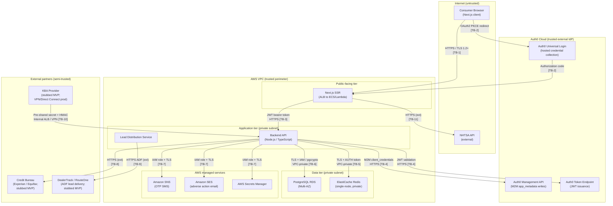

# Threat Model — Auto Leads Platform

> **Agent:** Cybersecurity SME
> **Project:** auto-leads-platform
> **Date:** 2026-04-11
> **Status:** Complete — Security Gate verdict at §6
> **Framework:** STRIDE
> **Standards applied:** GLBA Safeguards Rule (16 CFR Part 314), NIST SP 800-30, OWASP ASVS v4.0

---

## 1. Trust Boundary Map

**Trust boundary key:**

| ID | Boundary | Risk level |
|----|----------|------------|
| TB-1 | Consumer browser to Next.js (internet-facing) | High — untrusted client |
| TB-2 | Consumer browser to Auth0 Universal Login | Medium — hosted IdP, redirect-based |
| TB-3 | Next.js to Backend API | Medium — internal but carries JWT |
| TB-4 | Backend to Auth0 Management API | Medium — M2M credential, external call |
| TB-5 | Backend to ElastiCache Redis | Low — VPC-private, TLS + AUTH token |
| TB-6 | Backend to PostgreSQL RDS | Low — VPC-private, IAM + TLS |
| TB-7 | Backend to AWS managed services (SNS, SES, Secrets Manager) | Low — IAM role, within AWS |
| TB-8 | Backend to Credit bureau | High — external, carries consumer PII |
| TB-9 | Lead Distribution Service to DealerTrack / RouteOne | High — external, carries lead PII |
| TB-10 | KBA provider to Backend (inbound callback) | High — inbound from external party |
| TB-11 | Next.js to NHTSA API | Low — non-PII, public API |

---

## 2. STRIDE Analysis by Component

### 2.1 Consumer Browser / Next.js Frontend (TB-1)

| STRIDE category | Threat |
|-----------------|--------|
| Spoofing | Consumer presents a forged or stolen JWT to the Next.js BFF layer to impersonate another user. |
| Tampering | Consumer manipulates client-side form state (localStorage, URL params) to bypass step sequencing or inject different PII values than what was verified. |
| Repudiation | Consumer denies accepting the FCRA disclosure; no server-side audit record proving acceptance with timestamp, dealer name, IP, and user agent. |
| Information Disclosure | PII fields stored in browser localStorage or sessionStorage are exfiltrated via XSS. Next.js SSR error pages expose stack traces or internal state. |
| Denial of Service | Consumer submits rapid repeated requests to form submission endpoints, overwhelming backend capacity. |
| Elevation of Privilege | Consumer manipulates the disclosure_status parameter in a POST/PATCH request body to self-assert accepted consent without completing the disclosure flow. |

### 2.2 Auth0 Universal Login (TB-2)

| STRIDE category | Threat |
|-----------------|--------|
| Spoofing | OAuth state parameter not validated on callback; attacker injects a forged authorization code response (CSRF on OAuth callback). |
| Tampering | Auth0 Actions code modified to inject false kba_verified: true claims without backend verification events. |
| Repudiation | Auth0 tenant logs not exported to SIEM; login events unverifiable post-incident. |
| Information Disclosure | Auth0 tenant misconfiguration exposes app_metadata to the consumer-facing JWT (readable by the client); verification state visible. |
| Denial of Service | Auth0 outage or rate-limit block prevents all consumer logins; no fallback. |
| Elevation of Privilege | Consumer obtains another user's sub claim and calls the Auth0 Management API directly using a leaked M2M token to write kba_verified: true to their own profile. |

### 2.3 Backend API (TB-3, TB-4, TB-5, TB-6, TB-7)

| STRIDE category | Threat |
|-----------------|--------|
| Spoofing | Forged JWT presented to the backend API; backend honors it without verifying signature, issuer (iss), audience (aud), and expiry. |
| Tampering | Attacker modifies Redis cache values for kba_verified or verification_context if Redis AUTH token is compromised. Attacker sends tampered KBA callback payload if HMAC signature not validated before body parsing. |
| Repudiation | API mutation endpoints (PATCH /applications/:id/dealer, POST /applications/:id/consent) do not emit structured audit log entries; actions cannot be attributed post-incident. |
| Information Disclosure | Backend returns full application record (including AES-256-encrypted fields decrypted in response) to a requester who does not own the record (IDOR). Backend error responses include raw database error messages exposing schema or column names. |
| Denial of Service | OTP resend endpoint allows unlimited resends; SNS SMS costs spike; phone number enumeration via send timing. Consent POST endpoint lacks idempotency key; duplicate submissions create multiple fcra_consents rows for the same acceptance event. |
| Elevation of Privilege | PATCH /applications/:id/status is reachable by a consumer-authenticated request (not restricted to internal service layer). Consumer escalates their own application status to prequalified without a credit decisioning event. |

### 2.4 ElastiCache Redis (TB-5)

| STRIDE category | Threat |
|-----------------|--------|
| Spoofing | Backend connects to Redis using incorrect endpoint (DNS poisoning within VPC); verification state written to attacker-controlled cache. |
| Tampering | Redis AUTH token leaked; attacker writes kba_verified: true directly to verification:{session_id} key, bypassing KBA challenge. |
| Repudiation | No Redis command audit log; unauthorized writes to verification keys are undetectable after the fact. |
| Information Disclosure | Redis keyspace scan from a compromised internal service reveals active session IDs and verification state. TLS not configured; plaintext TCP traffic within VPC captured by a compromised compute node. |
| Denial of Service | Redis eviction under memory pressure (allkeys-lru) evicts active verification keys; consumers mid-flow experience re-verification prompts or hard failures if Management API also unavailable. |
| Elevation of Privilege | Fail-open logic: if Redis returns empty and Management API is unavailable, backend falls through and honors JWT claim alone — attacker exploits by triggering Redis unavailability (not applicable given hard-fail 503 design decision, but must be verified in implementation). |

### 2.5 PostgreSQL RDS (TB-6)

| STRIDE category | Threat |
|-----------------|--------|
| Spoofing | Database connection string embedded in environment variables rather than Secrets Manager; credential exfiltration via instance metadata service (IMDS). |
| Tampering | SQL injection via unsanitized inputs modifies fcra_consents.disclosure_status or applications.dealer_id outside controlled endpoints. fcra_consents rows mutated or deleted in violation of 7-year FCRA retention. |
| Repudiation | PostgreSQL audit logging (pgAudit) not enabled; no record of which service principal executed a given DML statement. |
| Information Disclosure | Column-level AES-256 encryption key stored alongside application code or in an environment variable rather than Secrets Manager; key compromise exposes all PII fields in plaintext. RDS snapshot shared accidentally to another AWS account. |
| Denial of Service | Long-running query or connection pool exhaustion from burst of concurrent submissions starves critical path endpoints. |
| Elevation of Privilege | Application database user granted DDL privileges; SQL injection yields DROP TABLE fcra_consents or schema modification. |

### 2.6 OTP / SMS via Amazon SNS (TB-7)

| STRIDE category | Threat |
|-----------------|--------|
| Spoofing | Attacker submits OTP on behalf of another consumer using a known phone number; OTP valid within 10-minute window if not rate-limited. |
| Tampering | SMS interception (SIM swap, SS7 attack) allows attacker to receive OTP for victim's registered phone number. |
| Repudiation | SNS delivery log not retained; no evidence OTP was sent to a specific number at a specific time if consumer disputes the OTP step. |
| Information Disclosure | OTP stored in plaintext in application memory or logs between generation and bcrypt hash storage. |
| Denial of Service | No server-side resend rate limit enables unlimited OTP resend requests, generating unbounded SNS costs and potential carrier spam classification. |
| Elevation of Privilege | Attacker uses SIM swap to receive OTP for a victim phone number, completes OTP verification, and gains access to a partially completed prequal application. |

### 2.7 KBA Callback Endpoint (TB-10)

| STRIDE category | Threat |
|-----------------|--------|
| Spoofing | Attacker sends a forged callback to POST /internal/kba/callback asserting kba_verified: true for any session_id; if endpoint is unauthenticated or uses simple string comparison for secret, attacker forces KBA verification for any consumer. |
| Tampering | Callback payload is tampered in transit (MITM between KBA provider and backend) to change the result field from fail to pass; HMAC validation not enforced before body parsing. |
| Repudiation | No structured audit log entry created for KBA callback events; kba_verified_at timestamp in fcra_consents is the only evidence, which would be absent if the callback was forged without writing to app_metadata. |
| Information Disclosure | Callback response body includes consumer PII (name, DOB, answers) echoed back from KBA provider and logged by backend middleware. |
| Denial of Service | KBA provider callback endpoint flooded by an attacker who has identified the endpoint; backend overwhelmed processing unauthenticated callback payloads before the secret check. |
| Elevation of Privilege | Unauthenticated callback endpoint allows any party who discovers the URL to set kba_verified: true in app_metadata for any Auth0 user ID, bypassing identity verification entirely. This is the highest-severity threat in the system. |

### 2.8 Credit Bureau Integration (TB-8, post-MVP)

| STRIDE category | Threat |
|-----------------|--------|
| Spoofing | Backend connects to a fraudulent bureau endpoint (DNS hijacking, SSRF) and submits consumer PII to an unauthorized recipient. |
| Tampering | Bureau response is tampered in transit to change a decline to an approval; TLS certificate validation bypassed. |
| Repudiation | No bureau request/response log; FCRA §1681b permissible purpose evidence is incomplete if the pull is disputed. |
| Information Disclosure | Full SSN (not SSN-4) sent to bureau erroneously; bureau API key hardcoded in source code and pushed to repository. |
| Denial of Service | Bureau API rate limit exceeded; retry logic without exponential backoff generates excessive concurrent pull attempts. |
| Elevation of Privilege | Bureau API credentials shared between environments; test pulls in staging use production consumer PII. |

### 2.9 Lead Distribution / ADF Delivery (TB-9, post-MVP)

| STRIDE category | Threat |
|-----------------|--------|
| Spoofing | Lead Distribution Service sends ADF lead using incorrect dealer ID; lead delivered to wrong dealer. |
| Tampering | ADF payload modified between Lead Distribution Service and DealerTrack/RouteOne; injected fields include SSN-4 or stated income hard-excluded by Legal SME. |
| Repudiation | No delivery receipt or API response logged for ADF submissions; disputed lead deliveries cannot be verified. |
| Information Disclosure | ADF payload includes SSN-4 or stated income in violation of GLBA Reg P consent scope; dealer receives data the consumer did not authorize for dealer sharing. |
| Denial of Service | DealerTrack/RouteOne API returns 5xx; retry storm sends duplicate leads to dealers. |
| Elevation of Privilege | Lead Distribution Service filter on status: PREQUALIFIED is bypassed by race condition or logic bug; adverse-outcome consumer generates a dealer lead. |

---

## 3. Threat Register

| ID | STRIDE | Component / Boundary | Threat description | Likelihood | Impact | Risk | Control / mitigation | Status |
|----|--------|---------------------|--------------------|------------|--------|------|----------------------|--------|
| T-01 | Elevation of Privilege | KBA callback (TB-10) | Unauthenticated POST /internal/kba/callback allows attacker to force kba_verified: true for any session without completing identity challenge | High | Critical | **Critical** | Pre-shared secret with crypto.timingSafeEqual() validation + HMAC-SHA256 payload signing; MVP: internal function call only, no HTTP endpoint registered | Mitigated (MVP); Open — mTLS migration required for production |
| T-02 | Tampering | KBA callback (TB-10) | MITM attacker modifies callback payload result field (fail to pass) before HMAC validation; backend processes tampered payload | Medium | Critical | **Critical** | HMAC-SHA256 payload signature validated before any body parsing or business logic; reject immediately on mismatch | Mitigated — confirmed in architecture.md §Item 5 |
| T-03 | Information Disclosure | PostgreSQL RDS (TB-6) | AES-256 column encryption key stored in environment variable or application config; key compromise exposes all PII in plaintext | Medium | Critical | **Critical** | Encryption key retrieved exclusively from AWS Secrets Manager via IAM role; never in env vars, source code, or .env files | Open — no explicit key management spec confirmed in reviewed artifacts |
| T-04 | Elevation of Privilege | Backend API (TB-3) | PATCH /applications/:id/status reachable by consumer-authenticated JWT; consumer self-escalates application status to PREQUALIFIED without credit decisioning event | Medium | Critical | **Critical** | Endpoint restricted to internal service layer at routing/middleware layer; consumer-origin JWT returns 403; enforced at API layer not just documentation | Mitigated — routing constraint confirmed in architecture.md §Item 3 |
| T-05 | Elevation of Privilege | Backend API (TB-3) | Consumer manipulates POST /applications/:id/consent request body to supply false verification timestamps or assert disclosure_status=accepted | High | Critical | **Critical** | Server writes otp_verified_at, kba_verified_at, verification_context from validated server-side session state only; client-supplied values rejected at schema validation layer | Mitigated — server-side population confirmed in architecture.md §Item 4 |
| T-06 | Information Disclosure | Backend API — IDOR (TB-3) | GET /applications/:id returns full application record for any authenticated consumer, not just the record owner; cross-consumer PII read | High | Critical | **Critical** | All application endpoints must validate applications.user_id equals authenticated JWT sub; return 404 (not 403) on mismatch to prevent resource enumeration | Open — no ownership enforcement spec confirmed in reviewed artifacts |
| T-07 | Elevation of Privilege | Lead Distribution Service (TB-9) | Filter on status: PREQUALIFIED bypassed by race condition or logic bug; adverse-outcome consumer generates dealer lead | Medium | High | **High** | Atomic status check within same DB transaction as lead dispatch; integration test for all non-PREQUALIFIED outcomes confirming no ADF payload generated | Open — no race-condition guard spec confirmed |
| T-08 | Information Disclosure | Lead Distribution Service (TB-9) | ADF payload includes SSN-4 or stated income in violation of GLBA Reg P consent scope | Low (hard-excluded at schema) | Critical | **High** | SSN and stated income hard-excluded at ADF schema layer; enforced via schema validation before serialization; automated test asserting absent fields on every ADF generation | Mitigated — decisions-log.md confirmed; requires automated test coverage |
| T-09 | Spoofing | Auth0 callback (TB-2) | OAuth state parameter not validated on authorization code callback; CSRF attack redirects victim's browser through attacker-controlled flow | Medium | High | **High** | Auth0 PKCE required; state parameter generated with CSPRNG and validated on callback; mismatch returns 400 and terminates flow | Open — PKCE enforcement must be verified in Auth0 application configuration |
| T-10 | Tampering | Redis cache (TB-5) | Redis AUTH token leaked; attacker writes kba_verified: true directly to verification:{session_id} key, bypassing KBA challenge | Low | Critical | **High** | AUTH token in Secrets Manager; backend retrieves at startup via IAM role; TLS enforced on all Redis connections; Redis on private subnet with security group inbound from backend SG only | Mitigated — confirmed in architecture.md §Item 1 |
| T-11 | Elevation of Privilege | Backend API / Redis (TB-5) | Fail-open path: Redis miss + Management API unavailable causes backend to honor JWT claim alone, granting KBA-level access without server-side verification | Medium | High | **High** | Hard-fail 503 on dual unavailability; do not fail open on JWT claim alone | Mitigated — engineering confirmations C4 and architecture.md §Item 1 confirmed; must be integration-tested |
| T-12 | Tampering | PostgreSQL RDS (TB-6) | SQL injection via unsanitized inputs modifies fcra_consents or applications records outside controlled endpoints | Medium | High | **High** | Parameterized queries / ORM only; no string-concatenated SQL; schema-level CHECK constraints provide defense-in-depth | Open — must be confirmed in code review gate; ORM/query layer spec not confirmed |
| T-13 | Information Disclosure | Backend API — list IDOR (TB-3) | Pagination or filter parameter manipulation on list endpoints returns records for other users | Medium | High | **High** | All list queries must include WHERE user_id = $authenticatedSub; query must never accept user_id filter from request body | Open — same ownership gap as T-06; applies to all list queries |
| T-14 | Spoofing | OTP flow (TB-7) | SIM swap attack: attacker ports victim phone number, receives OTP, completes OTP step | Low | High | **High** | Defense-in-depth: OTP alone does not complete identity verification (KBA required); lockout on 5 failed attempts; 30-minute lockout per phone number; phone number AES-256 encrypted at rest | Partially mitigated — residual SIM swap risk accepted as industry-standard posture for SMS OTP |
| T-15 | Repudiation | FCRA consent (TB-6) | Consumer denies accepting FCRA disclosure; audit record in fcra_consents is incomplete | Low | High | **High** | fcra_consents schema confirmed with ip_address, user_agent, otp_verified_at, kba_verified_at, verification_context, session_id, dealer_id; 7-year retention; never deleted | Mitigated — architecture.md §Item 4 confirmed |
| T-16 | Denial of Service | OTP endpoint | No server-side resend rate limit; unlimited OTP resend requests generate unbounded SNS costs | High | Medium | **High** | Server-side enforcement: max 3 resends per session, 60-second minimum between resends; 30-minute lockout per phone number | Mitigated — decisions-log.md confirmed |
| T-17 | Information Disclosure | JWT claims (TB-3, TB-8) | Access token containing kba_verified, otp_verified claims forwarded to credit bureau API; claims readable by bureau | Medium | Medium | **Medium** | Documented as intended behavior per session-verification-spec.md §1; bureau sees verification state, not raw KBA data; bureau is a regulated FCRA entity | Accepted — documented in session-verification-spec.md |
| T-18 | Repudiation | Backend API mutations | PATCH and POST mutation endpoints do not emit structured audit log entries; post-incident attribution impossible | Medium | High | **High** | Structured audit log entry required for every state mutation (dealer change, consent acceptance, status change, bureau pull, lead dispatch, adverse action notice sent, session invalidated) | Open — no explicit audit log spec confirmed in reviewed artifacts |
| T-19 | Information Disclosure | Backend API error responses (TB-3) | Backend returns raw database error messages in 500 responses; schema, column names, or query fragments exposed to consumer | Medium | Medium | **Medium** | All error responses normalized to structured error format; raw exceptions caught and logged server-side only; client receives opaque error code | Open — must be confirmed in implementation standards |
| T-20 | Tampering | FCRA disclosure render | Step 7 disclosure page served from ISR/static cache with stale dealer name; consumer sees Dealer A name but submits against Dealer B application state | Medium | High | **High** | Step 7 page is dynamic SSR only; no revalidate config; no caching headers; Next.js route config enforced and commented | Mitigated — decisions-log.md and architecture.md §Item 3 C5 confirmed |
| T-21 | Elevation of Privilege | Auth0 M2M token (TB-4) | M2M token leaked (logs, error response, accidental persistence); attacker uses it to write arbitrary app_metadata on any Auth0 user | Low | Critical | **High** | M2M token in-process memory only; never logged, written to Redis/DB/disk; token lifetime 24h with 5-min buffer refresh; Secrets Manager stores only client_secret, not the issued token | Mitigated — architecture.md §Item 2 confirmed |
| T-22 | Denial of Service | Application submission endpoint | Simultaneous duplicate prequal submissions; no idempotency key; creates duplicate applications and triggers duplicate bureau pulls | Medium | Medium | **Medium** | Idempotency key on POST /applications (global standard); unique constraint on applications table for active application per user | Open — idempotency key spec not confirmed in reviewed artifacts |
| T-23 | Information Disclosure | Secrets management | Backend service role granted PutSecretValue; compromised service role can overwrite production secrets to attacker-controlled values | Low | High | **Medium** | IAM policy: GetSecretValue + DescribeSecret only on named ARNs; PutSecretValue not granted to runtime role | Mitigated — architecture.md §Item 2 IAM policy confirmed |
| T-24 | Tampering | Bureau integration (TB-8, post-MVP) | TLS certificate validation disabled on bureau HTTP client; MITM substitutes fraudulent credit data | Low (post-MVP) | High | **Medium** | TLS certificate validation enforced (no rejectUnauthorized: false); bureau endpoint validated against known CA | Open — post-MVP item; must be in bureau integration brief |
| T-25 | Information Disclosure | RDS snapshot | RDS automated snapshot shared to incorrect AWS account via misconfiguration; full database including PII exposed | Low | Critical | **Medium** | Snapshot sharing disabled by policy; KMS key for RDS encryption not shared with external accounts; snapshot access reviewed quarterly | Open — no explicit snapshot policy spec confirmed |
| T-26 | Denial of Service | Auth0 dependency | Auth0 tenant outage blocks all consumer registrations and logins; no fallback authentication path | Low | High | **Medium** | Accepted: Auth0 SLA 99.9%; no architectural fallback warranted at MVP scale; incident response runbook required | Accepted with conditions — incident response runbook required |
| T-27 | Repudiation | SNS OTP delivery | No SNS delivery receipt stored; consumer disputes receiving OTP; no evidence of delivery | Medium | Medium | **Medium** | SNS CloudWatch delivery logs enabled; log retention configured to minimum 90 days | Open — retention policy not confirmed |
| T-28 | Information Disclosure | NHTSA API (TB-11) | Consumer browser directly calls NHTSA API, leaking vehicle interest via CORS or referrer headers | Low | Low | **Low** | NHTSA API call proxied through Next.js server-side route; browser does not call NHTSA directly | Open — must be confirmed in implementation (proxy vs. direct call) |

---

## 4. Critical and High Threats — Summary

### Critical Threats

| ID | Threat | Status |
|----|--------|--------|
| T-01 | Unauthenticated KBA callback allows forced KBA verification | Mitigated (MVP); production mTLS migration open |
| T-02 | KBA callback payload tampering via HMAC bypass | Mitigated |
| T-03 | AES-256 column encryption key in env var / not in Secrets Manager | **Open — Gate Blocker** |
| T-04 | Consumer self-escalates application status via PATCH /status | Mitigated |
| T-05 | Consumer supplies false verification timestamps in consent POST body | Mitigated |
| T-06 | IDOR: consumer reads another consumer's application record | **Open — Gate Blocker** |

### High Threats

| ID | Threat | Status |
|----|--------|--------|
| T-07 | PREQUALIFIED filter race condition generates leads for adverse outcomes | **Open — Pre-Release condition** |
| T-08 | ADF payload includes SSN-4 or stated income (GLBA violation) | Mitigated — automated test required |
| T-09 | OAuth state/PKCE not enforced; CSRF on authorization code callback | **Open — Pre-Release condition** |
| T-10 | Redis AUTH token leaked; direct cache write bypasses KBA | Mitigated |
| T-11 | Fail-open on dual Redis + Management API unavailability | Mitigated — integration test required |
| T-12 | SQL injection via unsanitized inputs | **Open — Pre-Release condition** |
| T-13 | IDOR on list endpoints (cross-consumer data exposure) | **Open — Gate Blocker (same fix as T-06)** |
| T-14 | SIM swap enables OTP bypass | Partially mitigated — residual risk accepted |
| T-15 | Incomplete fcra_consents audit record | Mitigated |
| T-16 | OTP resend rate limit not server-side enforced | Mitigated |
| T-18 | Mutation endpoints lack structured audit log | **Open — Gate Blocker** |
| T-20 | Step 7 disclosure served from cache with stale dealer name | Mitigated |
| T-21 | M2M token leaked and used for unauthorized app_metadata writes | Mitigated |

---

## 5. GLBA Safeguards Rule Assessment (16 CFR Part 314)

### 5.1 Access Controls (§314.4(c)(1))

**Requirement:** Limit access to customer information to authorized users with a legitimate business need; implement access controls on information systems.

| Control area | Current architecture | Gap |
|---|---|---|
| Consumer authentication | Auth0 Universal Login; 12-char minimum password; HIBP breach detection | None identified |
| MFA / step-up | OTP (SMS) + KBA for elevated operations; not optional | None identified |
| API authorization — ownership | JWT validation required on all protected endpoints; IDOR ownership enforcement not confirmed (T-06, T-13) | Gap: IDOR ownership enforcement spec required |
| Admin / operator access | Not specified in reviewed artifacts | Gap: no operator access control model documented |
| Application DB user privilege | Privilege level not confirmed in reviewed artifacts | Gap: DB user privilege spec not confirmed |
| M2M client scope | update:users broader than needed; field-level discipline enforced in code | Acknowledged; compensating control confirmed |

**Assessment: Partially compliant. IDOR ownership gap and operator access model gap require resolution.**

### 5.2 Encryption in Transit and at Rest (§314.4(e))

**Requirement:** Encrypt customer information in transit over external networks and, where feasible, at rest.

| Control area | Current architecture | Gap |
|---|---|---|
| Consumer to frontend | TLS 1.2+ mandatory | None |
| Frontend to backend | HTTPS with JWT bearer | None |
| Backend to Auth0 | HTTPS (Auth0 managed) | None |
| Backend to Redis | TLS enforced (transit-encryption-enabled) | None |
| Backend to RDS | TLS + IAM auth | None |
| Backend to SNS/SES | AWS SDK TLS default | None |
| Backend to bureau (post-MVP) | TLS cert validation required; T-24 open | Gap: cert validation spec open post-MVP |
| Lead delivery to DealerTrack/RouteOne (post-MVP) | TLS assumed; not confirmed in spec | Gap: TLS enforcement for ADF delivery not confirmed |
| RDS at rest — storage layer | AES-256 RDS encryption | None |
| RDS at rest — column level (PII) | AES-256 column encryption; key management spec absent | **Critical gap: T-03** |
| Redis at rest | KMS encryption enabled | None |
| Secrets Manager | AWS managed encryption | None |

**Assessment: Largely compliant with one Critical gap (column encryption key management, T-03) and two post-MVP items.**

### 5.3 Monitoring and Logging (§314.4(h))

**Requirement:** Monitor and test the effectiveness of key controls; maintain audit trails to detect and respond to security events.

| Control area | Current architecture | Gap |
|---|---|---|
| Authentication events | Auth0 tenant logs | Gap: SIEM export and retention period not specified |
| Application mutation events | Not confirmed (T-18) | Gap: structured audit log for mutations not specified |
| OTP delivery | SNS CloudWatch logs | Gap: retention policy not confirmed (T-27) |
| Redis access | ElastiCache CloudWatch metrics | No command-level audit log; keyspace monitoring not specified |
| RDS DML events | pgAudit configuration not confirmed | Gap: pgAudit not specified |
| KBA callback events | No explicit audit log spec | Gap: KBA callback events not audited |
| Bureau pull events (post-MVP) | Bureau request/response log not specified | Gap: FCRA permissible purpose record requires pull evidence |
| Lead delivery events | Not confirmed | Gap: ADF delivery receipt logging not specified |
| Anomaly detection / SIEM | Not specified | Gap: no SIEM, CloudTrail analysis, or anomaly alerting specified |

**Assessment: Significant gap. Structured audit logging is an open architectural item (T-18). GLBA requires demonstrable audit capability. This is a gate blocker.**

### 5.4 Incident Response (§314.4(i))

**Requirement:** Establish a written incident response plan addressing detection, response, containment, notification, and documentation.

| Requirement | Status |
|---|---|
| Written incident response plan | Not documented in reviewed artifacts |
| GLBA breach notification (FTC notification within 30 days for 500+ customer breaches, effective May 2022) | Procedure not specified |
| Containment procedures (session revocation, Redis flush, RDS snapshot) | Not specified |
| Auth0 suspicious activity response | Auth0 HIBP and anomaly detection enabled; response procedure not documented |

**Assessment: Gap. Incident response plan required before production. Mandatory GLBA requirement.**

### 5.5 Vendor / Service Provider Oversight (§314.4(f))

**Requirement:** Select and retain service providers that maintain appropriate safeguards; require safeguards by contract.

| Service provider | GLBA status | Gap |
|---|---|---|
| Auth0 (Okta) | SOC 2 Type II; BAA/DPA available | Confirm DPA executed for this tenant |
| AWS (SNS, SES, RDS, ElastiCache, Secrets Manager) | SOC 2 Type II, FedRAMP; BAA available | Confirm AWS BAA executed for account |
| Experian / Equifax (post-MVP) | FCRA-regulated consumer reporting agencies | Agreement required before live bureau integration |
| DealerTrack / RouteOne (post-MVP) | Nonaffiliated third parties under Reg P (confirmed); dealer enrollment agreements required | Enrollment agreement template required before first dealer onboarded |
| KBA provider (post-MVP) | Processes identity verification data; GLBA service provider agreement required | Agreement required before live KBA integration |

**Assessment: Pre-production; agreements not yet executed (expected for MVP). Dealer enrollment agreement template is a Legal SME-confirmed prerequisite before first dealer onboarding. All provider agreements must be in place before production launch.**

### GLBA Safeguards Summary

| Safeguards area | Assessment |
|---|---|
| Access controls | Partially compliant — IDOR gap; operator access model gap |
| Encryption in transit | Largely compliant — post-MVP external integration TLS gap |
| Encryption at rest | Critical gap — column encryption key management (T-03) |
| Monitoring and logging | Significant gap — structured audit log not specified (T-18) |
| Incident response | Gap — written plan not documented |
| Vendor oversight | Pre-production — agreements not yet executed (expected for MVP phase) |

---

## 6. Security Gate Verdict

**Verdict: PASS WITH CONDITIONS**

The MVP architecture reflects a sound security posture for a consumer financial services application. Auth0 Universal Login keeps credential handling outside the application layer. The layered session verification model (app_metadata authoritative record + Redis performance cache + server-side timestamp enforcement) is correctly designed. Field-scoped PATCH endpoints make the permitted write surface structural. Column-level AES-256 PII encryption is specified. The KBA callback is isolated as an internal function call at MVP with no exposed HTTP route. CSPRNG is mandated for OTP and confirmation number generation. Hard-fail 503 on dual-cache unavailability is explicitly confirmed. These are non-trivial controls implemented correctly at the design stage.

The Architecture Gate may proceed to the Build phase subject to the following conditions. Gate Blockers must be resolved before implementation of the affected components begins. Pre-Release conditions must be resolved before the Release Gate.

---

### Gate Blockers — resolve before implementation

**Gate Blocker 1 — Column encryption key management (T-03)**

The AES-256 column-level encryption key for PII fields has no confirmed key management specification in the reviewed artifacts. The architecture states the requirement; the implementation pathway is not specified. Before any endpoint that writes PII to RDS is implemented, the Lead Developer must receive a specification confirming: key stored in AWS Secrets Manager (not environment variables); key retrieved at service startup via IAM role; rotation procedure (annually at minimum, or on suspected compromise); and that no PII field write can execute if the key is unavailable at startup.

Resolves: T-03, GLBA §314.4(e) at-rest gap.
Required from: Architect + Lead Developer.

---

**Gate Blocker 2 — Application record ownership enforcement / IDOR (T-06, T-13)**

No ownership enforcement model is confirmed in the reviewed artifacts. Every application endpoint that returns or modifies application data must validate that applications.user_id equals the authenticated JWT sub before processing. The implementation brief must specify: 404 (not 403) returned on ownership mismatch to avoid resource enumeration; all list query WHERE clauses must include user_id = $authenticatedSub; no endpoint may accept a user_id filter from the request body. This applies to single-record and list endpoints equally.

Resolves: T-06, T-13, GLBA §314.4(c)(1) access control gap.
Required from: Lead Developer (spec confirmation in implementation brief).

---

**Gate Blocker 3 — Structured audit log specification (T-18)**

GLBA §314.4(h) requires audit trails. No structured audit log spec is confirmed in the reviewed artifacts. Before implementation, a specification must be produced covering: which events are audited (minimum: login, OTP verified, KBA verified, consent accepted, consent invalidated, dealer changed, bureau pull initiated, bureau pull result received, lead dispatched, adverse action notice sent, session invalidated, application status changed); the fields in each audit record (user_id, resource_id, action, timestamp, IP, user_agent, outcome); the storage mechanism (dedicated audit_events table in PostgreSQL, CloudWatch Logs, or dedicated audit service); and the retention period (minimum 7 years for FCRA-related events; minimum 2 years for all others under GLBA).

Resolves: T-18, GLBA §314.4(h) monitoring gap.
Required from: Architect + Lead Developer.

---

### Pre-Release Conditions — resolve before Release Gate

**Pre-Release 1 — Auth0 PKCE enforcement verification (T-09)**

PKCE must be confirmed as enforced in the Auth0 application configuration before the Release Gate. This is a configuration verification item. The Auth0 Application must have Enforce PKCE enabled. QA must include a test case confirming the authorization endpoint rejects authorization requests without a valid code_challenge parameter.

Resolves: T-09.
Required from: Lead Developer (configuration confirmation) + QA Analyst (test case).

---

**Pre-Release 2 — PREQUALIFIED filter atomicity spec (T-07)**

The Lead Distribution Service must include an atomic status check within the same database transaction as lead dispatch initiation. A specification confirming this atomicity pattern must be produced before the Lead Distribution Service is implemented. QA must include integration tests for all non-PREQUALIFIED outcomes confirming no ADF payload is generated under any timing scenario.

Resolves: T-07.
Required from: Lead Developer (implementation spec) + QA Analyst (integration test cases).

---

**Pre-Release 3 — SQL injection prevention confirmation (T-12)**

The implementation brief must explicitly confirm that all database interactions use an ORM or parameterized queries with no string-concatenated SQL permitted anywhere in the codebase. This must be a code review gate item. Any string-concatenated SQL on an endpoint touching applications, fcra_consents, or dealers is an independent Release Gate blocker.

Resolves: T-12.
Required from: Lead Developer (implementation standard) + QA Analyst (code review checklist).

---

**Pre-Release 4 — ADF payload field exclusion automated test (T-08)**

The hard-exclusion of SSN-4 and stated income from the ADF payload must be covered by an automated test that asserts the absence of these fields on every ADF payload generated, for every code path that produces an ADF payload. The test must fail if either field appears in the serialized ADF output.

Resolves: T-08.
Required from: QA Analyst (test case in test plan).

---

**Pre-Release 5 — Incident response plan (GLBA §314.4(i))**

A written incident response plan must be documented before production launch addressing: breach detection triggers, containment procedures (session revocation capability, Redis flush, RDS snapshot restoration), FTC breach notification procedure (30-day rule for breaches affecting 500+ customers), and internal escalation chain. This is an operational documentation requirement, not an architectural change.

Resolves: GLBA §314.4(i) gap.
Required from: Product Manager (owner) + Cybersecurity SME (review before sign-off).

---

**Pre-Release 6 — Service provider agreements (GLBA §314.4(f))**

Auth0 DPA, AWS BAA, and dealer enrollment agreement template must be executed before the first consumer data is processed in production. KBA provider agreement and bureau provider agreement required before those integrations go live post-MVP.

Resolves: GLBA §314.4(f) gap.
Required from: Legal SME (confirm execution).

---

### Post-MVP Condition — KBA callback mTLS migration (T-01)

The MVP pre-shared secret with internal function call isolation is an acceptable compensating control while KBA is stubbed. When the production KBA provider integration is live, mTLS is the required authentication pattern for the callback endpoint. If the KBA provider cannot support mTLS, a deviation requires formal Cybersecurity SME sign-off documenting the compensating controls (VPN network isolation + pre-shared secret + HMAC-SHA256 payload signing) as acceptable for the risk profile.

Resolves: T-01 production open item.
Required from: Architect + Cybersecurity SME at KBA production integration milestone.

---

### Accepted residual risk

| ID | Threat | Rationale |
|----|--------|-----------|
| T-14 | SIM swap / SS7 attack on OTP | Industry-standard residual risk for SMS OTP; mitigated by mandatory KBA as second factor; FIDO2/WebAuthn out of scope for MVP |
| T-17 | JWT claims visible to bureau API | Documented as intended; bureau is a regulated FCRA entity; claims contain verification state, not raw identity data |
| T-26 | Auth0 tenant outage | Auth0 SLA 99.9%; no IdP-layer architectural fallback warranted at MVP scale; incident response runbook required as condition |

---

*Threat model produced by Cybersecurity SME — 2026-04-11. Architecture Gate may proceed to Build phase when Gate Blockers 1, 2, and 3 are resolved with written specification updates. All Pre-Release Conditions must be satisfied and confirmed before the Release Gate is presented.*

---

*← [Auto Leads Platform — Progress](../progress.md)*
